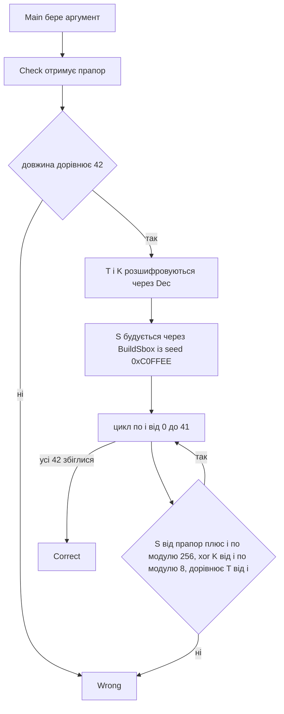

# 🛡️ Guardian, розбір завдання


| Поле | Значення |
| --- | --- |
| Файл | `Guardian.exe`, .NET збірка, близько 5.5 КБ, консольна |
| Запуск | `Guardian.exe <flag>` |
| Довжина прапора | рівно 42 символи |
| Категорія | Reverse Engineering |
| Прапор | `kpi2026{d0tn3t_1l_fl4tt3n1ng_p3rmut4t10ns}` |

---

## 📖 Що робить Guardian

Guardian це маленька консольна програма, яка перевіряє прапор. Ви передаєте його першим аргументом командного рядка. Далі програма робить таке.

1. Якщо аргумента немає, друкує підказку про використання.
2. Якщо довжина рядка не дорівнює 42, одразу відповідає Wrong.
3. Розшифровує два масиви байтів, які зашиті в самому файлі.
4. Будує таблицю підстановки з 256 чисел, перемішаних за фіксованим seed.
5. Для кожного з 42 символів рахує значення за однією формулою і порівнює його з еталонним байтом.
6. Якщо збіглися всі 42 позиції, друкує Correct, інакше Wrong.

Складність у тому, що програма написана на .NET, а перевірку навмисно заплутали.

---

## 🧰 Інструменти

| Інструмент | Для чого |
| --- | --- |
| `file` і `strings` | Визначити тип файлу та побачити імена методів і текстів |
| `ilspycmd` або `monodis` | Декомпілювати .NET код або вивести IL лістинг |
| Python з `dnfile` та `dncil` | Прочитати метадані, IL інструкції та зашиті дані |
| Python 3 | Відтворити алгоритм і розв'язати перевірку |

Ghidra для такого файлу не підходить, бо вона розрахована на машинний код процесора, а в .NET лежить проміжний код.

---

## 📚 Словничок для новачків

| Термін | Простими словами |
| --- | --- |
| .NET збірка | Програма, що зберігається не як готові команди процесора, а як проміжний код, який виконує середовище .NET. Його легко декомпілювати майже до вихідного вигляду. |
| IL або CIL | Мова цього проміжного коду. Прості інструкції на кшталт ldarg (взяти аргумент), add (додати), ret (повернути результат). |
| XOR, символ `^` | Побітова операція. Якщо застосувати її з тим самим ключем двічі, отримаєте початкове значення. Саме тому її легко відмотувати назад. |
| S box | Таблиця підстановки. Замість числа x беремо число з комірки з номером x. |
| Перестановка | Набір чисел, де кожне значення трапляється рівно один раз, але порядок змішаний. |
| Control flow flattening | Обфускація. Звичайний цикл розбирають на кроки й запускають через switch за змінною стану. Логіка та сама, а читається набагато гірше. |
| Seed | Початкове число генератора псевдовипадкових чисел. З тим самим seed завжди виходить та сама послідовність. |

---

## 🔍 Як ми розбирали Guardian

### Крок 1. Дізналися, що це за файл

```bash
file Guardian.exe
```

Відповідь показала Mono/.Net assembly, тобто перед нами керований код, а не звичайний x64.

### Крок 2. Подивилися рядки

```bash
strings -n 4 Guardian.exe
```

Одразу видно імена Dec, BuildSbox, Check, Main та поля TE, KE, SEED. У текстах програми знайшлися usage, Correct і Wrong. Це підказало, що логіка зосереджена у функції Check.

### Крок 3. Прочитали IL

Оскільки Ghidra тут марна, ми поставили бібліотеки для Python.

```bash
pip install dnfile dncil
```

З їхньою допомогою вивели IL усіх методів. Нижче ключові знахідки.

**Метод Dec.** Кожен байт масиву проходить через XOR з числом 110.

```text
ldelem.u1
ldc.i4.s 110
xor
```

**Метод BuildSbox.** Спершу створюється масив від 0 до 255, потім йде цикл від 255 донизу з двома характерними числами.

```text
ldc.i4 1103515245
mul
ldc.i4 12345
add
ldc.i4 2147483647
and
```

Числа 1103515245 і 12345 добре відомі. Це класичний лінійний конгруентний генератор. Разом з обміном елементів масиву це дає перемішування Фішера і Йейтса.

**Метод Check.** Спершу порівнюється довжина з 42. Далі в IL з'являється інструкція switch, яка керується змінною стану. Саме тут ховається control flow flattening.

### Крок 4. Розплутали стани

Ми виписали, що робить кожне значення змінної стану.

| Стан | Що відбувається |
| --- | --- |
| 0 | Лічильник i стає нулем, перехід у стан 1 |
| 1 | Якщо i не менше 42, перехід у стан 99, інакше у стан 2 |
| 2 | Рахуємо індекс, порівнюємо з еталоном, при збігу йдемо в стан 3, при розбіжності результат стає негативним |
| 3 | Збільшуємо i, повертаємося в стан 1 |
| 99 | Кінець, повертаємо результат |

Фактично це звичайний цикл for, просто розібраний на частини. Після такого розплутування логіка стає очевидною.

### Крок 5. Витягли дані

Масиви TE і KE лежать у секції `.sdata` як статичні дані. Їхні адреси ми знайшли через таблицю FieldRVA в `dnfile`. Після розшифровки XOR з 110 отримали два масиви.

```text
T, 42 байти
380e8e13d9d7cc2899d221b32240d3c4e761d3e28dba4ecc0db99a30abc7f7c5dffc6ee7d3f91c2faf93

K, 8 байтів
1337a55a710bee42
```

---

## ⚙️ Схема перевірки



### Формула перевірки

Для кожної позиції i має виконуватися рівність.

```text
S[(flag[i] + i) & 255] ^ K[i % 8] == T[i]
```

### Побудова таблиці

```text
S = числа від 0 до 255 по порядку
для i від 255 до 1
    seed = (seed * 1103515245 + 12345) & 0x7fffffff
    j = seed % (i + 1)
    поміняти місцями S[i] і S[j]
```

Початковий seed рівно 0xC0FFEE, тому таблиця щоразу однакова.

---

## 🔓 Як ми знайшли прапор

Усі операції у формулі оборотні, тому підбирати нічого не треба. Достатньо рухатися від кінця до початку.

1. Беремо T[i] і XOR'имо з K[i % 8]. Так отримуємо значення, яке стоїть у таблиці S.
2. Оскільки S є перестановкою, кожне значення зустрічається в ній лише один раз. Тому знаходимо номер комірки, де воно лежить. Позначимо його idx.
3. З рівності, що (flag[i] + i) за модулем 256 дорівнює idx, отримуємо flag[i] = (idx мінус i) за модулем 256.

Розв'язок єдиний, тож жодних неоднозначностей нема.

```python
import sys

d = open(sys.argv[1], "rb").read()

# TE і KE лежать у .sdata, зсуви знайдено через FieldRVA
TE = d[0xE00:0xE00 + 42]
KE = d[0xE30:0xE30 + 8]

T = bytes(b ^ 110 for b in TE)
K = bytes(b ^ 110 for b in KE)

def build_sbox(seed):
    s = list(range(256))
    for i in range(255, 0, -1):
        seed = (seed * 1103515245 + 12345) & 0x7FFFFFFF
        j = seed % (i + 1)
        s[i], s[j] = s[j], s[i]
    return s

S = build_sbox(0xC0FFEE)
pos = {v: i for i, v in enumerate(S)}   # обернена таблиця

flag = bytes((pos[T[i] ^ K[i % 8]] - i) & 255 for i in range(42))
print(flag.decode())

# перевірка прямим обчисленням
assert all((S[(c + i) & 255] ^ K[i % 8]) == T[i] for i, c in enumerate(flag))
```

```bash
python solve.py Guardian.exe
```

Результат збігається з очікуваним прапором, а пряма перевірка всіх 42 позицій проходить.

---

## 🏁 Прапор

```text
kpi2026{d0tn3t_1l_fl4tt3n1ng_p3rmut4t10ns}
```

Сам прапор підказує три ключові ідеї завдання. Це .NET IL, flattening та перестановки.

---

## 📚 Висновки

- .NET легко читається. Замість Ghidra краще брати ILSpy, dnSpy або `monodis`.
- Control flow flattening лише заплутує. Достатньо виписати, що робить кожен стан, і логіка відновлюється.
- Знайомі константи допомагають швидко впізнати алгоритм. Тут 1103515245 і 12345 одразу видали лінійний конгруентний генератор.
- Якщо всі операції оборотні, прапор не підбирають, а обчислюють. XOR і перестановка повністю зворотні.
- Фіксований seed означає, що таблицю можна відтворити без жодних секретів.
