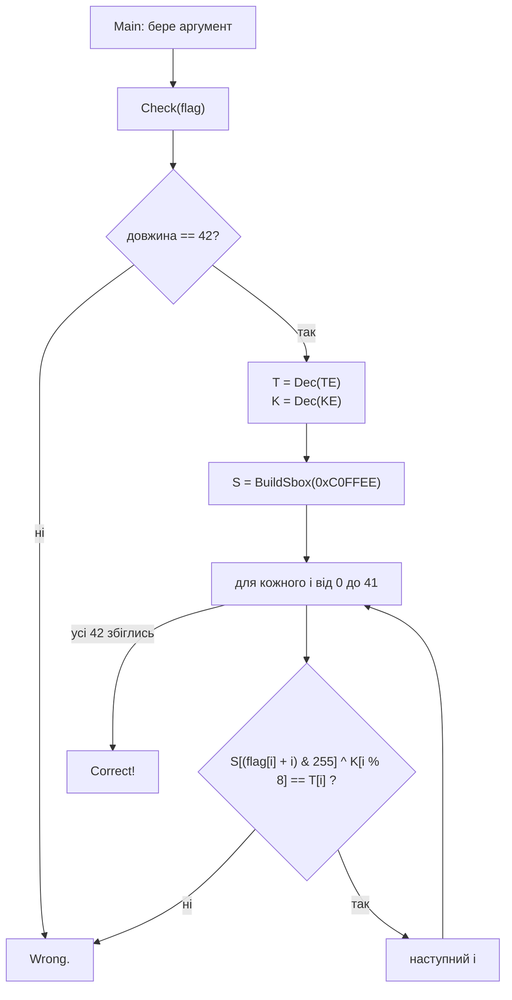

# 🛡️ Guardian — Writeup


-purple)


| Поле            | Значення                                                      |
| --------------- | ------------------------------------------------------------- |
| **Файл**        | `Guardian.exe` (.NET-збірка, ~5.5 КБ, консольна)              |
| **Запуск**      | `Guardian.exe <flag>`                                         |
| **Довжина**     | рівно 42 символи                                              |
| **Категорія**   | Reverse Engineering                                           |
| **Прапор**      | `kpi2026{d0tn3t_1l_fl4tt3n1ng_p3rmut4t10ns}`                  |

---

## 📖 Коротко про завдання

Програма перевіряє введений прапор і виводить `Correct!` або `Wrong.`.
Особливість: це **не звичайна програма «для процесора»**, а **.NET-збірка**, а її логіку ще й навмисно заплутали.

---

## 🧰 Інструменти

| Інструмент | Для чого |
| ---------- | -------- |
| `file`, `strings` | Визначити тип файлу й побачити назви методів та текстів |
| `ilspycmd` / `monodis` | Декомпілювати .NET-код у читабельний вигляд або в IL-лістинг |
| Python + `dnfile` + `dncil` | Прочитати метадані й IL-інструкції, витягти зашиті дані |
| Python 3 | Відтворити алгоритм і розв'язати перевірку |

> ⚠️ **Ghidra тут не підходить** для звичайного аналізу: вона розрахована на машинний код, а .NET містить проміжний код (IL).

---

## 📚 Словничок (для тих, хто вперше)

| Термін | Простими словами |
| ------ | ---------------- |
| **.NET-збірка** | Програма, яка зберігається не як готові команди процесора, а як проміжний код, що виконується середовищем .NET. Такий код **легко декомпілювати** майже до вихідного. |
| **IL / CIL** | Мова цього проміжного коду. Набір простих інструкцій на кшталт `ldarg` (взяти аргумент), `add` (додати), `ret` (повернути). |
| **XOR (`^`)** | Побітова операція «або-або». Корисна властивість: `(a ^ k) ^ k = a`, тобто повторний XOR тим самим ключем повертає початкове значення. |
| **S-box** | Таблиця підстановки: «замість значення *x* береш значення з комірки *x*». Тут це **перемішаний набір чисел 0–255**. |
| **Перестановка** | Ті самі числа, що йдуть в іншому порядку (кожне число зустрічається рівно один раз). Її легко відмотати назад. |
| **Control-flow flattening** | Прийом обфускації: нормальний цикл «розплющують» у `switch` по змінній-«стану». Логіка та сама, але читати її важко. |
| **Seed** | Початкове число для генератора псевдовипадкових чисел. З однаковим seed завжди виходить однакова послідовність. |

---

## 🔍 1. Первинний огляд

```bash
file Guardian.exe
# PE32 executable (console) Intel 80386 Mono/.Net assembly

strings -n 4 Guardian.exe
```

У рядках видно імена методів і полів: `Dec`, `BuildSbox`, `Check`, `Main`, `TE`, `KE`, `SEED`. А в текстах програми: `usage: Guardian.exe <flag>`, `Correct!`, `Wrong.`

---

## ⚙️ 2. Як влаштована програма



### Псевдокод

```text
Check(flag):
    якщо довжина flag != 42 → Wrong
    T = Dec(TE)                 # Dec(): кожен байт XOR 110
    K = Dec(KE)
    S = BuildSbox(0xC0FFEE)     # перемішана таблиця 0..255
    для i від 0 до 41:
        якщо S[(flag[i] + i) & 255] ^ K[i % 8] != T[i] → Wrong
    → Correct
```

### 2.1 `Dec`: розшифрування даних

Кожен байт масиву просто XOR'иться з числом `110`:

```text
Dec(x) = [ b ^ 110  для кожного байта b у x ]
```

`TE` (42 байти) і `KE` (8 байтів) лежать у секції `.sdata`. Після `Dec` отримуємо:

```text
T = 380e8e13d9d7cc2899d221b32240d3c4e761d3e28dba4ecc0db99a30abc7f7c5dffc6ee7d3f91c2faf93
K = 1337a55a710bee42
```

### 2.2 `BuildSbox(seed)`: перемішана таблиця

Початково `S = [0, 1, 2, ..., 255]`, далі її перемішують алгоритмом **Fisher–Yates** з простим генератором випадкових чисел:

```text
для i від 255 до 1:
    seed = (seed * 1103515245 + 12345) & 0x7fffffff
    j    = seed % (i + 1)
    поміняти місцями S[i] і S[j]
```

Seed фіксований: `0xC0FFEE`, тож таблиця завжди **однакова** і її можна відтворити.

### 2.3 Control-flow flattening в `Check`

Цикл перевірки в IL виглядає не як звичайний `for`, а як `switch` по змінній стану:

| Стан | Що робить |
| ---- | --------- |
| `0` | Скидає лічильник `i = 0`, переходить у стан `1` |
| `1` | Якщо `i >= 42` → стан `99` (кінець), інакше → стан `2` |
| `2` | Рахує індекс `(flag[i] + i) & 255` і порівнює `S[..] ^ K[i % 8]` з `T[i]`; при збігу → стан `3`, інакше результат = «невірно» |
| `3` | `i++`, повертається в стан `1` |
| `99` | Вихід, повертає результат |

Це **той самий звичайний цикл**, просто заплутаний. Якщо «розплющити» його назад, виходить псевдокод вище.

---

## 🔓 3. Розв'язання

Для кожної позиції *i* перевірка виглядає так:

```text
S[(flag[i] + i) & 255] ^ K[i % 8] == T[i]
```

Усе в цій формулі **оборотне**, тому прапор можна обчислити, а не підбирати:

1. `S[...] = T[i] ^ K[i % 8]`, адже XOR відмотується тим самим ключем.
2. Оскільки `S` — перестановка (кожне число зустрічається один раз), знаходимо, **в якій комірці** лежить це значення: це індекс `idx`.
3. `(flag[i] + i) & 255 = idx`, звідки `flag[i] = (idx - i) & 255`.

Розв'язок єдиний, бо кожне значення в `S` трапляється рівно раз.

```python
import sys

d = open(sys.argv[1], "rb").read()

# TE та KE лежать у .sdata (зсуви у файлі знайдено через dnfile / FieldRVA)
TE = d[0xE00:0xE00 + 42]
KE = d[0xE30:0xE30 + 8]

T = bytes(b ^ 110 for b in TE)
K = bytes(b ^ 110 for b in KE)

def build_sbox(seed):
    s = list(range(256))
    for i in range(255, 0, -1):
        seed = (seed * 1103515245 + 12345) & 0x7FFFFFFF
        j = seed % (i + 1)
        s[i], s[j] = s[j], s[i]
    return s

S = build_sbox(0xC0FFEE)
pos = {v: i for i, v in enumerate(S)}      # обернена таблиця: значення → індекс

flag = bytes((pos[T[i] ^ K[i % 8]] - i) & 255 for i in range(42))
print(flag.decode())

# перевірка прямим обчисленням
assert all((S[(c + i) & 255] ^ K[i % 8]) == T[i] for i, c in enumerate(flag))
```

```bash
python solve.py Guardian.exe
# kpi2026{d0tn3t_1l_fl4tt3n1ng_p3rmut4t10ns}
```

> 📝 Зсуви `0xE00` і `0xE30`: це місця у файлі, де лежать масиви `TE` і `KE`. Їх знаходять через таблицю `FieldRVA` (бібліотека `dnfile`). Якщо відкрити збірку декомпілятором, ці масиви видно прямо в коді як статичні поля.

---

## 🏁 Прапор

```
kpi2026{d0tn3t_1l_fl4tt3n1ng_p3rmut4t10ns}
```

Прапор підказує три ключові речі: **.NET IL**, **flattening** (розплющений потік керування) і **permutations** (перестановка S-box).

---

## 📚 Висновки

- **.NET легко читається.** Замість Ghidra беріть ILSpy / dnSpy / `monodis`: код майже повністю відновлюється.
- **Flattening лише заплутує.** Знайдіть змінну-стан і випишіть, що робить кожен стан, і логіка стане зрозумілою.
- **Якщо операції оборотні, не підбирайте, а відмотуйте.** XOR і перестановка повністю зворотні, тому прапор обчислюється формулою за мілісекунди.
- **Фіксований seed = відтворювана таблиця.** Достатньо повторити генератор, і секрет не потрібен.
