| Поле            | Значення                                                      |
| --------------- | ------------------------------------------------------------- |
| **Файл**        | `crackme.exe` (PE32+, x86-64, MinGW/GCC, ~40 КБ, не запакований) |
| **Запуск**      | `crackme.exe <flag>`                                          |
| **Довжина**     | рівно 41 символ                                               |
| **Категорія**   | Reverse Engineering                                           |
| **Прапор**      | `kpi2026{tls_c4llb4cks_h1de_th3_r34l_c0de}`                   |

---

## 🧰 Інструменти

| Інструмент                    | Для чого                                                    |
| ----------------------------- | ----------------------------------------------------------- |
| `file`, `strings`             | Первинний огляд: тип файлу, рядки, імпорти                  |
| `objdump -h / -p / -s / -d`   | Секції, PE-заголовки (TLS), дамп даних, дизасемблювання     |
| Ghidra (або IDA)              | Зручне читання `main` і TLS-колбека                         |
| x64dbg / WinDbg (опційно)     | Динамічний аналіз, перевірка анти-відладки                  |
| Python 3                      | XOR-розшифрування стабу та обернення перевірки              |

---

## 🔍 1. Первинний огляд

```bash
file crackme.exe
strings -n 5 crackme.exe
objdump -h crackme.exe
```

Що видно одразу:

- Рядки: `usage: %s <flag>`, `Wrong length.`, `Correct!`, `Wrong.`
- Імпорти: **`VirtualAlloc`**, **`VirtualProtect`**, **`IsDebuggerPresent`**
- Є секція **`.tls`**, а це підозріло для такого простого консольного додатка.
- Секція **`.bss`** у файлі порожня (нулі), значення з'являються лише під час запуску.

---

## 🚩 2. На що звернути увагу

| Ознака | Чому це важливо |
| ------ | --------------- |
| Виклик `call [rip+...]` у `main` на адресу `0x14000c030` | Виклик **за вказівником**, а не напряму. Функція невідома статично. |
| `0x14000c030` лежить у `.bss` | У файлі там нулі, вказівник записується **під час запуску**. |
| Секція `.tls` + масив колбеків | **TLS callback** виконується **до `main`**. Відладчики й дизасемблери часто його пропускають. |
| `VirtualAlloc` + `VirtualProtect` | Пам'ять виділяють, наповнюють байтами й роблять виконуваною: **код створюється на льоту**. |
| `IsDebuggerPresent` | Від результату залежить **ключ розшифровки**, тобто це анти-відладка. |

---

## ⚙️ 3. Як це працює

```mermaid
flowchart TD
    A[Запуск процесу] --> B[TLS callback 0x1400014d0<br/>reason == DLL_PROCESS_ATTACH]
    B --> C[VirtualAlloc 0x1000, RW]
    B --> D{IsDebuggerPresent?}
    D -- ні --> E[ключ = 0x9e]
    D -- так --> F[ключ = 0x61]
    E --> G[XOR 32 байтів з .rdata 0x140009070]
    F --> G
    G --> H[VirtualProtect → PAGE_EXECUTE_READ]
    H --> I[адреса → DAT_14000c030]
    I --> J[main: перевірка довжини 41]
    J --> K[цикл: f&#40;input i, i&#41; == ref i ?]
    K -- всі збіглись --> L[Correct!]
    K -- хоч один ні --> M[Wrong.]
```



### TLS callback (`0x1400014d0`)

1. Спрацьовує лише при `reason == 1` (`DLL_PROCESS_ATTACH`).
2. `VirtualAlloc(NULL, 0x1000, MEM_COMMIT | MEM_RESERVE, PAGE_READWRITE)`.
3. `IsDebuggerPresent()` → вибір ключа:
   - відладчика немає → **`0x9e`**
   - відладчик є → **`0x61`**
4. 32 байти з `.rdata` (`0x140009070`) XOR'яться цим ключем і копіюються у виділену пам'ять.
5. `VirtualProtect(..., PAGE_EXECUTE_READ)` робить пам'ять виконуваною.
6. Адреса пам'яті записується у `DAT_14000c030`.

> 💡 **Анти-відладка.** З ключем `0x61` вийде сміття замість коду, і програма під відладчиком поводитиметься хибно. Тому розшифровувати треба **ключем `0x9e`**.

### Розшифрований стаб

Зашифровані байти (`0x140009070`):

```
91285fda 912854db f5578fda af56bb61 9e9e9e27 9b9e9e9e 4c5eaa5d 91285e5d
```

Після XOR з `0x9e`:

```
0fb6c1 440fb6ca 456bc911 4431c8 25ff000000 b905000000 d2c0 34c3 0fb6c0 c3
```

Дизасемблювання:

```asm
movzx eax, cl           ; eax = символ c
movzx r9d, dl           ; r9d  = індекс i
imul  r9d, r9d, 0x11    ; i * 0x11
xor   eax, r9d          ; c ^ (i*0x11)
and   eax, 0xff
mov   ecx, 5
rol   al, cl            ; циклічний зсув вліво на 5
xor   al, 0xc3
movzx eax, al
ret
```

У вигляді формули (для кожного байта):

```
f(c, i) = ROL8( (c ^ ((i * 0x11) & 0xff)), 5 ) ^ 0xc3
```

### `main`

1. Перевіряє довжину (`41`), інакше `Wrong length.`
2. У циклі для кожного `i` викликає `f(input[i], i)` і порівнює з `ref[i]`, де `ref` лежить за адресою **`0x140009040`** (41 байт).
3. Якщо хоч один байт не збігся, виводить `Wrong.`

Еталонні байти `ref`:

```
ae efaa e34d 2fc9 425c 7df8 5f36 fe93 b18d 61e9 c627 8400 155c 5a7f 3455 18f7 6ca1 6306 4223 6b9f 9d79
```

---

## 🔓 4. Розв'язання

Функція `f` складається лише з оборотних операцій (XOR, циклічний зсув), тому **Z3 не потрібен**, достатньо відмотати її назад:

```
c = ROR8( ref[i] ^ 0xc3, 5 ) ^ ((i * 0x11) & 0xff)
```

```python
import sys

DATA = open(sys.argv[1], "rb").read()

def rdata(va, n):
    # .rdata: VA 0x140009000 → зсув у файлі 0x7400
    off = va - 0x140009000 + 0x7400
    return DATA[off:off + n]

ref = rdata(0x140009040, 41)

def ror8(x, n): return ((x >> n) | (x << (8 - n))) & 0xFF

flag = bytes(ror8(r ^ 0xC3, 5) ^ ((i * 0x11) & 0xFF) for i, r in enumerate(ref))
print(flag.decode())
```

```bash
python solve.py crackme.exe
# kpi2026{tls_c4llb4cks_h1de_th3_r34l_c0de}
```

✅ **Перевірка:** пряме обчислення `f(flag[i], i)` для всіх 41 позицій збігається з `ref`.

---

## 🏁 Прапор

```
kpi2026{tls_c4llb4cks_h1de_th3_r34l_c0de}
```

Сам прапор підказує головну ідею: *TLS callbacks hide the real code*.

---

## 📚 Висновки

- **Код може з'явитися до `main`.** Завжди перевіряйте TLS-директорію (`objdump -p`, Ghidra → *Entry points*, x64dbg → *Break on TLS callbacks*).
- **Виклик за вказівником із `.bss`** означає, що потрібно знайти, де цей вказівник записується.
- **`VirtualAlloc` + `VirtualProtect(EXEC)`** — сигнал, що код розшифровується або генерується на льоту.
- **Анти-відладка тут тонка.** `IsDebuggerPresent` не завершує програму, а змінює ключ, тож під відладчиком отримаєте сміття, а не очевидну помилку.
- Якщо перевірка складається з оборотних операцій, її простіше **інвертувати**, ніж моделювати в SMT.
