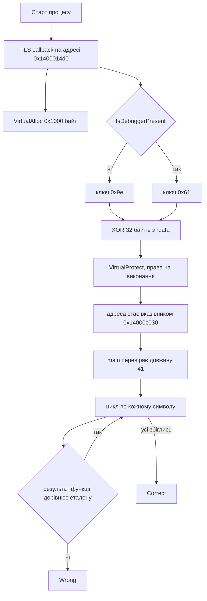

# 🕵️ crackme, розбір завдання


| Поле | Значення |
| --- | --- |
| Файл | `crackme.exe`, PE32+ x86-64, MinGW/GCC, близько 40 КБ, не запакований |
| Запуск | `crackme.exe <flag>` |
| Довжина прапора | рівно 41 символ |
| Категорія | Reverse Engineering |
| Прапор | `kpi2026{tls_c4llb4cks_h1de_th3_r34l_c0de}` |

---

## 📖 Що робить crackme

crackme це консольна програма, яка перевіряє прапор. Ви передаєте його першим аргументом. Далі відбувається таке.

1. Ще до запуску main Windows викликає спеціальну функцію, яка готує код перевірки.
2. Ця функція виділяє пам'ять, розшифровує в неї маленький шматок коду й робить пам'ять виконуваною.
3. Ключ розшифрування залежить від того, чи запущено програму під відладчиком.
4. Потім main перевіряє довжину прапора, яка має бути 41.
5. Для кожного символа main викликає розшифровану функцію й порівнює результат з еталонним байтом.
6. Якщо збіглись усі позиції, друкує Correct, інакше Wrong.

Хитрість у тому, що справжньої перевірки у файлі статично майже не видно. Вона з'являється в пам'яті лише під час запуску.

---

## 🧰 Інструменти

| Інструмент | Для чого |
| --- | --- |
| `file`, `strings` | Тип файлу, текстові повідомлення, список імпортів |
| `objdump -h`, `-p`, `-s`, `-d` | Секції, PE заголовки з TLS, дамп даних, дизасемблювання |
| Ghidra | Зручне читання main і функції в TLS |
| x64dbg | Динамічний аналіз, зупинка на TLS callback |
| Python 3 | Розшифрувати шматок коду й обернути перевірку |

---

## 📚 Словник термінів

| Термін | Простими словами |
| --- | --- |
| TLS | Thread Local Storage, тобто сховище даних, яке в Windows у кожного потоку своє |
| TLS callback | Функція, яку Windows сама викликає, коли процес або потік стартує чи завершується. Вона може виконатися раніше за main. Це не окремий потік і не окремий процес, це звичайна функція з особливим моментом виклику |
| Чому це важливо | Відладчики за замовчуванням часто зупиняються лише на main, тож код у TLS callback легко пропустити |
| Секція `.bss` | Ділянка пам'яті, яка у файлі порожня, а значення отримує вже під час роботи |
| `VirtualAlloc` | Системна функція, що виділяє нову пам'ять |
| `VirtualProtect` | Системна функція, що змінює права на пам'ять, наприклад дозволяє її виконувати |
| Виклик за вказівником | Команда виклику, яка бере адресу функції зі змінної, а не має її прямо в коді |
| `IsDebuggerPresent` | Системна функція, яка повертає одиницю, якщо програму відлагоджують |
| XOR | Побітова операція. Двічі застосована з тим самим ключем повертає початкове значення |
| ROL | Циклічний зсув бітів вліво, біти, що вилізли зліва, повертаються справа |

---

## 🔍 Як  розбирати crackme

### Крок 1. Дізналися, що це за файл

```bash
file crackme.exe
strings -n 5 crackme.exe
objdump -h crackme.exe
```

Це нативний x64 для Windows. У рядках видно usage: %s <flag>, Wrong length., Correct! та Wrong. Серед імпортів помітні `VirtualAlloc`, `VirtualProtect` та `IsDebuggerPresent`. У списку секцій є `.bss` і `.tls`. Для такої простої програми це вже підозріло.

### Крок 2. Знайшли дивний виклик у main

У main є команда виклику за вказівником.

```asm
call QWORD PTR [rip+0x4418]    ; адреса 0x14000c030
```

Адреса `0x14000c030` лежить у секції `.bss`, а вона у файлі порожня. Отже, функцію, яку викликають, хтось записує під час запуску.

### Крок 3. Знайшли, хто пише цей вказівник

Пошук за адресою `0x14000c030` в дизасемблері дав дві згадки. Одна це сам виклик у main, друга це запис у функції за адресою `0x1400014d0`. Саме вона виділяє пам'ять і готує код.

### Крок 4. Перевірили, що це TLS callback

```bash
objdump -p crackme.exe
```

У заголовках є запис Thread Storage Directory. Він містить адресу масиву функцій, які Windows викликає на старті. Там першою стоїть саме `0x1400014d0`. Тобто ця функція виконується до main, це і є TLS callback.

Також вона починається з перевірки, що причина виклику дорівнює одиниці. Це означає старт процесу, тому далі код виконується лише один раз.

### Крок 5. Прочитали, що робить TLS callback

| Дія | Подробиці |
| --- | --- |
| Виділення пам'яті | `VirtualAlloc` на 0x1000 байт з правами на читання й запис |
| Перевірка відладчика | `IsDebuggerPresent` повертає нуль або одиницю |
| Вибір ключа | без відладчика 0x9e, з відладчиком 0x61 |
| Розшифрування | 32 байти з `.rdata` за адресою `0x140009070` проходять XOR з ключем |
| Копіювання | розшифровані байти кладуться у виділену пам'ять |
| Права виконання | `VirtualProtect` змінює захист на читання й виконання |
| Запис адреси | початок виділеної пам'яті потрапляє у вказівник `0x14000c030` |

Ключ рахується хитрою інструкцією sbb, яка перетворює результат IsDebuggerPresent на число. Після перерахунку виходить 0x9e для нуля й 0x61 для одиниці.

Це проста анти відладка. Під відладчиком код розшифрується неправильним ключем і перетвориться на сміття, тож програма поводитиметься хибно.

### Крок 6. Розшифрували код 

Зашифровані байти за адресою `0x140009070` такі.

```text
91285fda 912854db f5578fda af56bb61 9e9e9e27 9b9e9e9e 4c5eaa5d 91285e5d
```

Після XOR з ключем 0x9e отримуємо машинний код.

```text
0fb6c1 440fb6ca 456bc911 4431c8 25ff000000 b905000000 d2c0 34c3 0fb6c0 c3
```

У вигляді асемблера він виглядає так.

```asm
movzx eax, cl           ; eax це символ c
movzx r9d, dl           ; r9d це індекс i
imul  r9d, r9d, 0x11    ; i помножити на 0x11
xor   eax, r9d          ; c XOR (i помножити на 0x11)
and   eax, 0xff
mov   ecx, 5
rol   al, cl            ; циклічний зсув вліво на 5 біт
xor   al, 0xc3
movzx eax, al
ret
```

Тобто для кожного символа c на позиції i функція рахує одне байтове значення.

```text
f(c, i) = ROL8( c XOR ((i * 0x11) & 0xff), 5 ) XOR 0xc3
```

### Крок 7. Подивилися, що робить main

Main перевіряє довжину 41. Далі у циклі для кожного i викликає f від символа і індекса й порівнює результат з байтом еталона. Еталон лежить за адресою `0x140009040`, всього 41 байт.

```text
aeefaae34d2fc9425c7df85f36fe93b18d61e9c6278400155c5a7f345518f76ca1630642236b9f9d79
```

Якщо хоч один байт не збігся, програма виводить Wrong.

---

## ⚙️ Схема роботи



---

## 🔓 Як  знайти прапор

Функція f складається лише з оборотних операцій, тобто XOR і циклічного зсуву. Тому Z3 тут не потрібен, достатньо відмотати кожну операцію у зворотному порядку.

1. Беремо байт еталона ref[i] і робимо XOR з 0xc3.
2. Циклічно зсуваємо вправо на 5 біт, це скасовує зсув вліво.
3. Робимо XOR з числом (i помножити на 0x11) за модулем 256.

Результат це символ прапора на позиції i.

```python
import sys

DATA = open(sys.argv[1], "rb").read()

def rdata(va, n):
    # секція .rdata, віртуальна адреса 0x140009000, зсув у файлі 0x7400
    off = va - 0x140009000 + 0x7400
    return DATA[off:off + n]

ref = rdata(0x140009040, 41)

def ror8(x, n):
    return ((x >> n) | (x << (8 - n))) & 0xFF

flag = bytes(ror8(r ^ 0xC3, 5) ^ ((i * 0x11) & 0xFF) for i, r in enumerate(ref))
print(flag.decode())
```

```bash
python solve.py crackme.exe
```

Для перевірки ми порахували f для кожного символа знайденого прапора. Усі 41 значення збіглися з еталоном.

---

## 🏁 Прапор

```text
kpi2026{tls_c4llb4cks_h1de_th3_r34l_c0de}
```

Прапор підказує головне. TLS callbacks ховають справжній код.

---

## 📚 Висновки

- Код може виконатися ще до main. Завжди дивіться TLS директорію, наприклад командою `objdump -p`, а в x64dbg вмикайте зупинку на TLS callback.
- Виклик за вказівником зі секції `.bss` означає, що потрібно знайти, де цей вказівник записується.
- Зв'язка `VirtualAlloc` і `VirtualProtect` з правами на виконання майже завжди означає код, який розшифровується або створюється на льоту.
- Анти відладка тут тонка. Програма не закривається, а просто змінює ключ, тож під відладчиком ви отримаєте сміття, а не очевидну помилку.
- Якщо перевірка складається з оборотних операцій, її простіше обернути, ніж моделювати в SMT.
