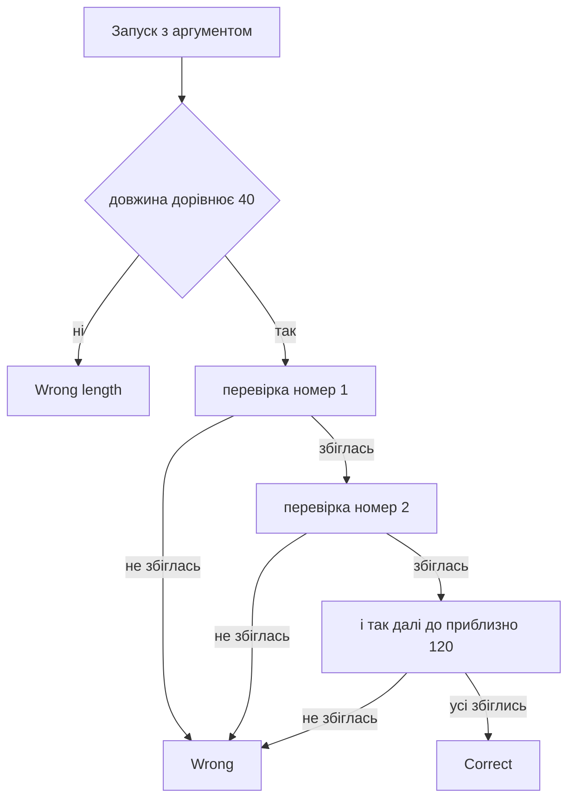

# 🔑 keymaster, розбір завдання


| Поле | Значення |
| --- | --- |
| Файл | `keymaster.exe`, PE32+ x86-64, близько 48 КБ, консольний |
| Запуск | `keymaster.exe <flag>` |
| Довжина прапора | рівно 40 символів |
| Категорія | Reverse Engineering |
| Прапор | `kpi2026{p0lyn0m14l_syst3ms_yi3ld_t0_smt}` |

---

## 📖 Що робить keymaster

keymaster це маленька консольна програма, яка перевіряє прапор. Ви передаєте його першим аргументом командного рядка. Далі програма робить таке.

1. Якщо аргумента немає, друкує підказку про використання.
2. Якщо довжина рядка не дорівнює 40, відповідає Wrong length.
3. Перевіряє введений рядок приблизно 120 разів поспіль, щоразу за новою формулою.
4. Кожна формула бере кілька символів, перемножує й додає їх між собою, інколи додає XOR, і порівнює результат із числом, зашитим у файл.
5. Якщо хоч одна перевірка не збіглась, друкує Wrong.
6. Якщо збіглись усі, друкує Correct.

По суті це система приблизно зі 120 рівнянь із 40 невідомими, де невідомі це символи прапора. Вручну такий розв'язок не підібрати, бо комбінацій забагато.

---

## 🧰 Інструменти

| Інструмент | Для чого |
| --- | --- |
| `file` і `strings` | Визначити тип файлу та знайти текстові повідомлення |
| `objdump` або Ghidra | Дизасемблювати код і знайти функцію з перевірками |
| Python 3 | Зібрати рівняння в скрипт |
| Z3 (`z3-solver`) | Знайти символи, що задовольняють усі рівняння одразу |

---

## 📚 Словник

| Термін | Простими словами |
| --- | --- |
| Дизасемблер | Програма, що перетворює машинний код назад у читабельні інструкції асемблера |
| Асемблер | Запис команд процесора текстом, наприклад add (додати), imul (помножити), cmp (порівняти) |
| XOR, символ `^` | Побітова операція, яка зустрічається в частині перевірок |
| Рівняння | Тут це рівність виду вираз дорівнює числу, яку має виконати введений рядок |
| SMT розв'язувач | Програма, яка за набором умов сама шукає значення змінних, що їх усі задовольняють |
| Z3 | Найпопулярніший SMT розв'язувач від Microsoft Research |
| Бітвектор | Число фіксованої розрядності, яке поводиться як у процесорі, зі зворотним переходом через межу |

---

## 🔍 Як  розбирати keymaster

### Крок 1. Дізналися, що це за файл

```bash
file keymaster.exe
```

Відповідь показала PE32+ executable, console, x86-64. Це звичайна нативна програма для Windows, тож Ghidra або `objdump` підходять.

### Крок 2. Подивилися рядки

```bash
strings -n 5 keymaster.exe
```

Знайшлися тексти usage: %s <flag>, Wrong length., Correct! The flag is the input you provided. та Wrong. Звідси два висновки. Прапор передається аргументом, а не вводиться з клавіатури. А сама програма сама підтверджує, що введений рядок і є прапором.

### Крок 3. Знайшли функцію перевірки

```bash
objdump -d -M intel keymaster.exe > dump.txt
```

Шукаємо в дампі, де використовуються адреси текстів. Вони лежать у секції `.rdata` починаючи з `0x14000c000`. Три посилання вказали на кінець функції main.

| Адреса | Що там |
| --- | --- |
| `0x14000a00d` | вивід тексту Wrong, куди ведуть усі невдалі перевірки |
| `0x14000a093` | вивід тексту Correct |
| `0x14000a0a7` | вивід підказки usage |

### Крок 4. Прочитали, як виглядає одна перевірка

Усі невдалі гілки стрибають в один і той самий блок Wrong. Кожна перевірка це окремий шматок коду такого вигляду.

```asm
mov   edx, DWORD PTR [rsp+0x48]
imul  edx, esi
add   edx, esi
cmp   edx, 0x3127
jne   <Wrong>
```

Читається просто. Беремо кілька значень з локальних змінних, множимо, додаємо, порівнюємо з константою. Якщо не рівно, програма падає на Wrong. Інші перевірки схожі, але з іншими комбінаціями множень, додавань і XOR. Реальні константи, які ми побачили в коді, це `0x3127`, `0xb1c` та `0x2e0e`.

### Крок 5. Оцінити масштаб

Підрахунок інструкцій у дизасемблері показав понад двісті множень і понад сотню порівнянь із константами. Це узгоджується з описом завдання, тобто з приблизно 120 рівняннями.


## ⚙️ Схема перевірки



---

## 🔓 Як  знайти прапор

### Чому підходить Z3

1. Рівняння нелінійні, бо є добутки змінних, тому звичайна лінійна алгебра не працює.
2. Рівнянь приблизно 120, а невідомих 40. Система перевизначена, тож розв'язок зазвичай єдиний.
3. Для операцій над байтами зручні бітвектори, бо вони точно повторюють поведінку процесора.

### Що  додали як підказки

Усі символи друковані ASCII, тобто від 0x20 до 0x7E. Також відомий формат прапора, тобто початок kpi2026{ та закриваюча дужка. Це прискорює пошук і відсікає зайві розв'язки.

### Скрипт

Рівняння нижче лише ілюстрація того, як виглядає запис. У реальному розв'язку на їхнє місце підставляються всі приблизно 120 виразів, витягнутих із дизасемблера.

```python
from z3 import BitVec, Solver, sat, And

N = 40
x = [BitVec(f"x{i}", 32) for i in range(N)]
s = Solver()

# усі символи друковані ASCII
for xi in x:
    s.add(And(xi >= 0x20, xi <= 0x7E))

# відомий формат прапора
for i, ch in enumerate("kpi2026{"):
    s.add(x[i] == ord(ch))
s.add(x[N - 1] == ord("}"))

# приблизно 120 рівнянь з бінарника, тут лише приклади
s.add(x[3] * x[17] + x[5] == 0x3127)
s.add((x[9] ^ x[21]) + x[4] * x[30] == 0x0B1C)
# ... решта рівнянь ...

if s.check() == sat:
    m = s.model()
    print("".join(chr(m[xi].as_long()) for xi in x))
else:
    print("Розв'язку немає, перевірте рівняння")
```

```bash
pip install z3-solver
python solve.py
```

Z3 знаходить усі 40 значень за лічені секунди, бо працює алгоритмами розв'язання обмежень, а не перебором. Отримані числа перетворюємо на символи ASCII, і виходить прапор.

---

## 🏁 Прапор

```text
kpi2026{p0lyn0m14l_syst3ms_yi3ld_t0_smt}
```

Прапор сам підказує ідею. Polynomial systems yield to SMT означає, що поліноміальні системи піддаються SMT розв'язувачам.

---

## 📚 Висновки

- Якщо програма зводиться до багатьох арифметичних обмежень на вхід, не перебирайте, а моделюйте.
- Перевизначена система майже завжди має єдиний розв'язок.
- Додаткові обмеження на символи прискорюють пошук і відсікають хибні відповіді.
- Знайти спільний блок невдачі, у нашому випадку Wrong, найшвидший спосіб зрозуміти структуру функції.
