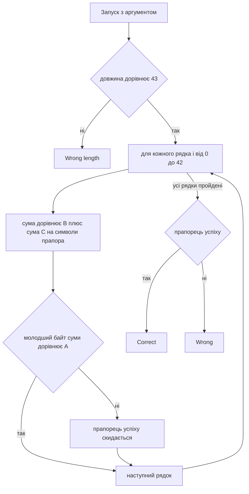

# 🧮 matrix, розбір завдання


| Поле | Значення |
| --- | --- |
| Файл | `matrix.exe`, PE32+ x86-64, близько 42 КБ, консольний |
| Запуск | `matrix.exe <flag>` |
| Довжина прапора | рівно 43 символи |
| Категорія | Reverse Engineering |
| Ідея | система лінійних рівнянь за модулем 256 |
| Прапор | `kpi2026{l1n34r_4lg3br4_m0d_256_1s_s0lv4bl3}` |

---

## 📖 Що робить matrix

matrix це консольна програма, яка перевіряє прапор. Прапор передається першим аргументом командного рядка. Далі відбувається таке.

1. Якщо аргумента немає, друкується підказка usage.
2. Якщо довжина рядка не дорівнює 43, друкується Wrong length.
3. Для кожного з 43 рядків перевірки програма бере вільне число, додає до нього суму добутків коефіцієнтів на символи прапора й порівнює результат з очікуваним числом.
4. Порівнюється лише молодший байт результату. Через це арифметика фактично ведеться за модулем 256.
5. Якщо збіглись усі 43 рядки, друкується Correct, інакше Wrong.

Символи перевіряються не по одному, а всі разом. Кожна формула залежить від усіх 43 символів, тому вгадувати прапор по частинах неможливо.

---

## 🧰 Інструменти

| Інструмент | Для чого |
| --- | --- |
| `file` і `strings` | Тип файлу та текстові повідомлення |
| `objdump -h`, `-s`, `-d` | Секції, дамп таблиць, дизасемблювання |
| Ghidra | Зручне читання функції перевірки |
| Python 3 | Витяг таблиць і розв'язання системи |
| Z3 (необов'язково) | Альтернативний розв'язувач, але тут повільний |

---

## 📚 Словник

| Термін | Простими словами |
| --- | --- |
| Лінійне рівняння | Рівняння, де змінні лише множаться на числа й додаються, без добутків змінних між собою |
| Система рівнянь | Кілька рівнянь, які мають виконуватися одночасно |
| Матриця | Таблиця чисел. Тут це таблиця 43 на 43, де кожен рядок описує одне рівняння |
| Модуль 256 | Арифметика як на лічильнику, що рахує до 255 і знову починає з нуля. Саме так поводиться один байт |
| Оборотна матриця | Така, для якої система має рівно один розв'язок |
| Метод Гауса | Систематичне віднімання одних рівнянь від інших, поки не залишиться по одній змінній у кожному |
| Парне й непарне число | За модулем 256 на число можна ділити, тільки якщо воно непарне. Це важливо для методу Гауса |
| Ранг | Скільки рівнянь у системі справді незалежні. Ранг 43 з 43 означає, що зайвих рівнянь немає |

---

## 🔍 Як розбирався matrix

### Крок 1. Визначення типу файлу

```bash
file matrix.exe
strings -n 4 matrix.exe
```

Файл виявився нативною програмою для Windows x64. У рядках видно usage: %s <flag>, Wrong length., Correct! та Wrong. Прапор, отже, передається аргументом.

### Крок 2. Пошук функції перевірки

```bash
objdump -d -M intel matrix.exe > dump.txt
```

Функція перевірки починається за адресою `0x140007b10`. Вона одразу порівнює довжину з 43.

```asm
cmp rax, 0x2b      ; 0x2b це 43
jne <Wrong length>
```

### Крок 3. Два вкладені цикли

Далі йде кістяк перевірки. Це два вкладені цикли, обидва по 43 кроки.

```asm
; зовнішній цикл, r10 це номер рядка i
movzx ecx, BYTE PTR [rbp+r10]       ; ecx = B[i], вільний доданок

; внутрішній цикл, rax це номер символа j
movzx edx, BYTE PTR [r9+rax]        ; edx = C[i][j], коефіцієнт
movzx r8d, BYTE PTR [rbx+rax]       ; r8d = flag[j], символ прапора
imul  edx, r8d                      ; коефіцієнт помножити на символ
add   ecx, edx                      ; додати до суми

; після внутрішнього циклу
cmp BYTE PTR [rdi+r10], cl          ; порівняти A[i] з молодшим байтом суми
cmovne r11d, esi                    ; якщо не збіглось, скинути прапорець успіху
add r9, 0x2b                        ; перейти до наступного рядка матриці
```

Формула кожного рядка така.

```text
(B[i] + C[i][0]*flag[0] + C[i][1]*flag[1] + ... + C[i][42]*flag[42]) mod 256 == A[i]
```

Окремої операції взяття за модулем 256 у коді немає. Вона виходить сама, бо порівнюється лише регістр `cl`, тобто молодший байт.

### Крок 4. Адреси таблиць

Три таблиці лежать у секції `.rdata`, їхні адреси видно в інструкціях `lea`.

| Таблиця | Адреса | Розмір | Що це |
| --- | --- | --- | --- |
| A | `0x140009040` | 43 байти | очікувані результати |
| B | `0x140009080` | 43 байти | вільні доданки |
| C | `0x1400090c0` | 1849 байтів | матриця коефіцієнтів 43 на 43, рядок за рядком |

Значення таблиць A і B.

```text
A
35071c2c2512e0c0995242428ada3fc320660487f6108f8603d93210d460a0d2b883f15846cc2420ec0b65

B
d91c457250ad65aa3ba46e8045d988c29e549e5df5747e60ddd8570654495611124ef629a499f5be1b9655
```

Матриця C завелика для запису тут, її зручніше читати прямо з файлу скриптом.

### Крок 5. Аналіз системи

Формулу можна переписати як звичайну систему лінійних рівнянь.

```text
C * flag = A - B     (за модулем 256)
```

Невідомі це 43 символи прапора, рівнянь теж 43. Така система має єдиний розв'язок, якщо матриця C оборотна за модулем 256. А це відбувається тоді, коли вона оборотна за модулем 2, тобто коли визначник непарний. Перевірка за модулем 2 показала ранг 43 з 43, отже розв'язок існує і він єдиний.

---

## ⚙️ Схема перевірки



---

## 🔓 Як знайдено прапор

### Метод Гауса за модулем 256

Ідея та сама, що в шкільній алгебрі, але ділити можна лише на непарні числа. Тому на кожному кроці як опорний елемент береться рядок, де в потрібному стовпці стоїть непарне число. Такий елемент має обернене значення за модулем 256, яке знаходиться вбудованою функцією `pow(x, -1, 256)`.

Кроки для кожного стовпця.

1. Знайти рядок із непарним числом у цьому стовпці й поставити його на потрібне місце.
2. Помножити рядок на обернене значення, щоб опорний елемент став одиницею.
3. Відняти цей рядок від усіх інших з відповідним множником, щоб у стовпці лишилась одна одиниця.

Після 43 кроків у правому стовпці лежать потрібні символи.

```python
import sys

d = open(sys.argv[1], "rb").read()

def rdata(va, n):
    # секція .rdata, віртуальна адреса 0x140009000, зсув у файлі 0x7400
    off = va - 0x140009000 + 0x7400
    return d[off:off + n]

N = 43
A = rdata(0x140009040, N)
B = rdata(0x140009080, N)
C_flat = rdata(0x1400090C0, N * N)
C = [list(C_flat[i * N:(i + 1) * N]) for i in range(N)]

# розширена матриця: коефіцієнти і права частина A мінус B
aug = [C[i][:] + [(A[i] - B[i]) & 255] for i in range(N)]

for col in range(N):
    # опорний рядок з непарним елементом у цьому стовпці
    p = next(r for r in range(col, N) if aug[r][col] & 1)
    aug[col], aug[p] = aug[p], aug[col]
    inv = pow(aug[col][col], -1, 256)
    aug[col] = [(v * inv) & 255 for v in aug[col]]
    for r in range(N):
        if r != col and aug[r][col]:
            f = aug[r][col]
            aug[r] = [(a - f * b) & 255 for a, b in zip(aug[r], aug[col])]

flag = bytes(aug[i][N] for i in range(N))
print(flag.decode())

# перевірка прямою підстановкою
assert all(
    (B[i] + sum(C[i][j] * flag[j] for j in range(N))) & 255 == A[i]
    for i in range(N)
)
```

```bash
python solve.py matrix.exe
```

Скрипт видає прапор менш ніж за секунду, а перевірка підстановкою в усі 43 рівняння проходить.

### Чому не Z3

Систему можна подати й розв'язувачу Z3, записавши 43 обмеження над 8 бітними змінними.

```python
from z3 import BitVec, Solver

x = [BitVec(f"x{j}", 8) for j in range(N)]
s = Solver()
for i in range(N):
    s.add(B[i] + sum(C[i][j] * x[j] for j in range(N)) == A[i])
s.check()
```

Це коректний запис, але на щільній системі 43 на 43 за модулем 256 розв'язувач відпрацьовує дуже довго. У тестовому запуску він не завершився за п'ять хвилин. Причина проста. SMT розв'язувачі добре справляються з розрідженими умовами, а тут кожне рівняння містить усі 43 змінні. Для лінійних систем набагато ефективніша звичайна лінійна алгебра.

---

## 🏁 Прапор

```text
kpi2026{l1n34r_4lg3br4_m0d_256_1s_s0lv4bl3}
```

Прапор говорить про те саме. Лінійна алгебра за модулем 256 розв'язується.

---

## 📚 Висновки

- Подвійний цикл із сумою добутків і порівнянням у кінці це ознака матричного перетворення, тобто системи лінійних рівнянь.
- Модуль 256 виникає сам, коли порівнюється лише один байт. Явної операції взяття за модулем в коді може не бути.
- Якщо матриця оборотна за модулем 2, то вона оборотна й за модулем 256, а отже розв'язок єдиний.
- Для лінійних систем краще використовувати метод Гауса, ніж SMT розв'язувач. Z3 вартий уваги для нелінійних умов, як у keymaster.
- Таблиці коефіцієнтів лежать прямо у файлі, їх достатньо прочитати за адресами з інструкцій `lea`.
