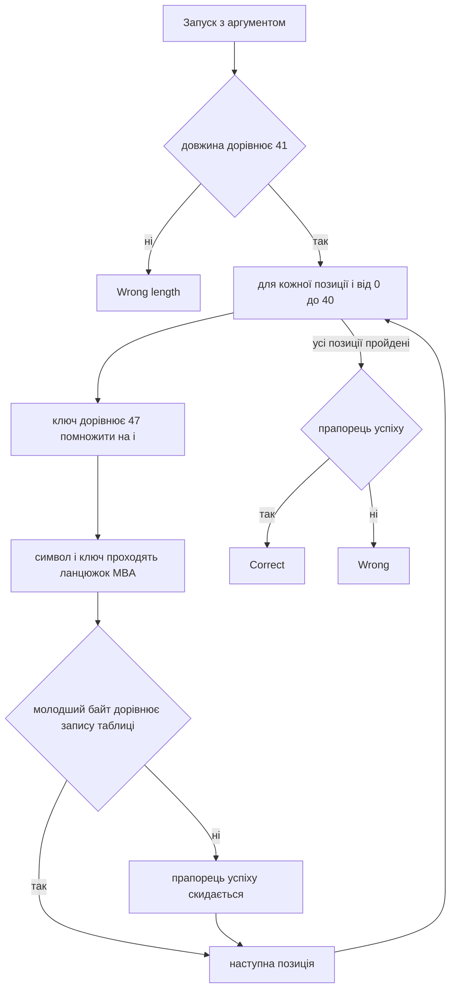

# 🧩 mba, розбір завдання


| Поле | Значення |
| --- | --- |
| Файл | `mba.exe`, PE32+ x86-64, близько 40 КБ, консольний |
| Запуск | `mba.exe <flag>` |
| Довжина прапора | рівно 41 символ |
| Категорія | Reverse Engineering |
| Ідея | обфускація MBA, перевірка кожного символа окремо |
| Прапор | `kpi2026{m1x3d_b00l34n_4r1thm3t1c_unf0lds}` |

---

## 📖 Що робить mba

mba це консольна програма, яка перевіряє прапор. Прапор передається першим аргументом командного рядка. Далі відбувається таке.

1. Якщо аргумента немає, друкується підказка usage.
2. Якщо довжина рядка не дорівнює 41, друкується Wrong length.
3. Для кожного символа на позиції i рахується ключ позиції, `key = 47 * i`.
4. Символ і ключ проходять довгий ланцюжок бітових і арифметичних операцій.
5. Молодший байт результату порівнюється зі значенням із таблиці, зашитої у файл.
6. Якщо для всіх 41 позицій збіглось, друкується Correct, інакше Wrong.

Кожен символ перевіряється окремо й не залежить від сусідніх. Саме ця незалежність робить розв'язок простим, хоч формула й виглядає жахливо.

---

## 🧰 Інструменти

| Інструмент | Для чого |
| --- | --- |
| `file` і `strings` | Тип файлу та текстові повідомлення |
| `objdump -h`, `-s`, `-d` | Секції, дамп таблиці, дизасемблювання |
| Ghidra | Зручне читання функції перевірки |
| Python 3 | Відтворення ланцюжка й перебір |

---

## 📚 Словник

| Термін | Простими словами |
| --- | --- |
| MBA | Mixed Boolean Arithmetic, тобто змішана булева арифметика. Прості дії замінюють довгими еквівалентними сумішами бітових операцій та додавань |
| Обфускація | Навмисне ускладнення коду, щоб його було важко читати, але результат лишався тим самим |
| XOR, AND, OR | Побітові операції. XOR дає одиницю, де біти різні, AND де обидва одиничні, OR де хоч один одиничний |
| NEG | Зміна знака числа на протилежний |
| Еквівалентні вирази | Різні записи, які завжди дають однаковий результат. Наприклад, сума двох чисел дорівнює XOR плюс подвоєне AND |
| `lea` | Інструкція процесора, яку компілятор часто використовує для швидкого обчислення виразів на кшталт a плюс b помножити на 2 |
| Перебір | Просте випробування всіх можливих значень. Для одного байта їх лише 256 |
| Бієкція | Відповідність, у якій кожному входу відповідає свій окремий вихід. Тоді розв'язок завжди єдиний |

---

## 🔍 Як розбирався mba

### Крок 1. Визначення типу файлу

```bash
file mba.exe
strings -n 4 mba.exe
```

Файл виявився нативною програмою для Windows x64. У рядках видно usage: %s <flag>, Wrong length., Correct! та Wrong. Прапор передається аргументом.

### Крок 2. Пошук функції перевірки

```bash
objdump -d -M intel mba.exe > dump.txt
```

Перевірка починається з порівняння довжини.

```asm
cmp rax, 0x29      ; 0x29 це 41
jne <Wrong length>
```

### Крок 3. Каркас циклу

Одразу після перевірки довжини видно кістяк циклу з трьох регістрів.

```asm
mov r9d, 0                 ; r9d це ключ, стартує з нуля
mov r8d, 0                 ; r8 це номер позиції i
lea rsi, [rip+0x7b34]      ; rsi вказує на таблицю, адреса 0x140009040
...
movzx edx, BYTE PTR [rbx+r8]    ; edx це символ прапора
...
cmp DWORD PTR [rsi+r8*4], eax   ; порівняння із записом таблиці
cmovne r10d, r11d               ; не збіглось, прапорець успіху скидається
add r8, 1                       ; наступна позиція
add r9d, 0x2f                   ; ключ збільшується на 47
cmp r8, 0x29                    ; повторити 41 раз
```

Звідси видно головне. На позиції i ключ дорівнює 47 помножити на i, бо 0x2f це 47. Таблиця містить по 4 байти на запис, і порівнюється вона з однобайтовим результатом.

### Крок 4. Ланцюжок MBA

Між завантаженням символа й порівнянням лежить близько сорока інструкцій. Вони використовують лише кілька операцій, зате постійно перемішують їх. Ось початок.

```asm
mov ecx, edx
or  ecx, r9d          ; ecx дорівнює c OR k
mov eax, edx
and eax, r9d          ; eax дорівнює c AND k
mov edi, eax
xor edi, 0x1
and edi, 0x1
mov ebp, eax
xor ebp, 0xfffffffe
lea edi, [rbp+rdi*2]  ; edi дорівнює ebp плюс 2 помножити на edi
```

Далі такі самі пари дій повторюються з константами `0x7c` та `0x35`, є інверсія знака `neg`, а в кінці відбувається віднімання.

```asm
neg eax
...
and ebp, 0x7c
add ebp, ebp
...
or  edx, 0x35
...
and eax, 0x35
sub edx, eax
movzx eax, dl         ; береться лише молодший байт
```

Як побудована така обфускація. Для звичайного додавання існують відомі тотожності.

```text
x + y = (x XOR y) + 2 * (x AND y)
x + y = (x OR y) + (x AND y)
```

Конструкція `lea eax, [rcx+rax*2]` після пари `xor` та `and` саме так і працює. Тобто проста дія розтягнута в довгий ланцюжок еквівалентних кроків, а сенс шукати немає потреби.

### Крок 5. Витяг таблиці

Таблиця лежить за адресою `0x140009040` у секції `.rdata`, 41 запис по 4 байти. Усі значення менші за 256.

```text
210 238 134  14  61  96 157 155 164  39  31 135 249 141  89  88   9 218 204 240
 11  53 143 242 224 106  31  33 166 150  26 123  14 195 249 178  29  22  47 227 148
```

---

## ⚙️ Схема перевірки



---

## 🔓 Як знайдено прапор

Підхід спирається на два факти.

1. Кожен символ перевіряється окремо, тож задача розпадається на 41 маленьку.
2. Символ має лише 256 можливих значень, тому для кожної позиції можна просто спробувати їх усі.

Розбиратися в тому, що саме рахує формула, не треба. Достатньо відтворити її інструкція за інструкцією, зберігаючи 32 бітну арифметику процесора, а потім перебрати всі символи.

Усього виходить 41 помножити на 256, тобто 10 496 обчислень, і це відбувається миттєво.

```python
import struct
import sys

d = open(sys.argv[1], "rb").read()

def rdata(va, n):
    # секція .rdata, віртуальна адреса 0x140009000, зсув у файлі 0x7400
    off = va - 0x140009000 + 0x7400
    return d[off:off + n]

table = struct.unpack("<41I", rdata(0x140009040, 41 * 4))
M = 0xFFFFFFFF   # арифметика 32 бітна, як у процесорі

def f(c, k):
    # кожен рядок відповідає одній інструкції з дизасемблера
    ecx = (c | k) & M                # or  ecx, r9d
    eax = c & k                      # and eax, r9d
    edi = (eax ^ 1) & 1              # xor edi, 1 ; and edi, 1
    ebp = eax ^ 0xFFFFFFFE           # xor ebp, 0xfffffffe
    edi = (ebp + edi * 2) & M        # lea edi, [rbp+rdi*2]
    edx = ((c ^ k) & eax) & M        # xor edx, r9d ; and edx, eax
    edx = (ecx + edx * 2) & M        # lea edx, [rcx+rdx*2]
    edx = (edx + edi) & M            # add edx, edi
    eax = (-eax) & M                 # neg eax
    ebp = ecx & eax                  # and ebp, eax
    eax ^= ecx                       # xor eax, ecx
    ebp = (eax + ebp * 2) & M        # lea ebp, [rax+rbp*2]
    ebp &= 0x7C                      # and ebp, 0x7c
    ebp = (ebp + ebp) & M            # add ebp, ebp
    eax = (edx ^ 0x7C) & ebp        # xor eax, 0x7c ; and eax, ebp
    edx ^= ebp                       # xor edx, ebp
    edx ^= 0x7C                      # xor edx, 0x7c
    edx = (edx + eax * 2) & M        # lea edx, [rdx+rax*2]
    edx |= 0x35                      # or  edx, 0x35
    eax = ecx & edi                  # and eax, edi
    ecx ^= edi                       # xor ecx, edi
    eax = (ecx + eax * 2) & M        # lea eax, [rcx+rax*2]
    eax ^= 0x7C                      # xor eax, 0x7c
    eax = (eax + ebp) & M            # add eax, ebp
    eax &= 0x35                      # and eax, 0x35
    edx = (edx - eax) & M            # sub edx, eax
    return edx & 0xFF                # movzx eax, dl

flag = bytearray()
for i in range(41):
    k = 47 * i
    hits = [c for c in range(256) if f(c, k) == table[i]]
    assert len(hits) == 1, (i, hits)
    flag.append(hits[0])

print(flag.decode())
```

```bash
python solve.py mba.exe
```

Для кожної з 41 позиції знайшлося рівно одне значення байта, тож розв'язок єдиний. Перевірка показала, що для кожного ключа функція дає різні результати на всіх 256 вхідних байтах, тобто це бієкція.

---

## 🏁 Прапор

```text
kpi2026{m1x3d_b00l34n_4r1thm3t1c_unf0lds}
```

Прапор натякає на головне. Змішана булева арифметика розгортається, якщо діяти механічно.

---

## 📚 Висновки

- Довгий ланцюжок бітових операцій не означає складну задачу. Якщо його можна відтворити, його можна й обчислити.
- Не обов'язково розуміти, що рахує MBA вираз. Достатньо точно повторити, як він рахує, інструкція за інструкцією.
- Незалежна перевірка кожного символа руйнує всю складність. Замість 256 в сорок першому степені варіантів лишається 41 помножити на 256.
- У відтворенні важливо зберігати 32 бітну поведінку, тобто накладати маску після кожного додавання, віднімання та зміни знака.
- Таблиця може зберігатись не байтами, а чотирибайтовими числами. Це видно за множником 4 в `cmp DWORD PTR [rsi+r8*4]`.
- Якщо потрібно справді спростити такий вираз, існують спеціальні інструменти, але для цього завдання перебору достатньо.
