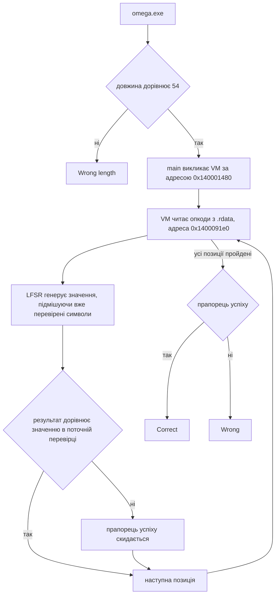

# 🧩 omega, розбір завдання


| Поле | Значення |
| --- | --- |
| Файл | `omega.exe`, PE32+ x86-64, близько 40 КБ, консольний |
| Запуск | `omega.exe <flag>` |
| Довжина прапора | рівно 54 символи |
| Категорія | Reverse Engineering |
| Ідея | власна байткод VM з LFSR, перевірку розв'язано через емуляцію |
| Прапор | `kpi2026{st4ck_vm_plus_lfsr_and_sb0x_1s_th3_f1n4l_b0ss}` |

## 📖 Що робить omega

omega це нативний бінарник для Windows x64, зібраний MinGW, не запакований. Найскладніший файл набору. Замість готової формули перевірки, main викликає власний інтерпретатор байткоду, свою маленьку віртуальну машину. Справжня логіка перевірки флага лежить не в коді, а в даних, які цей код виконує.

## 🧰 Інструменти

| Інструмент | Для чого |
| --- | --- |
| `file`, `objdump -h` | Тип файлу, секції |
| `objdump -d` | Пошук входу main і функції VM |
| Ghidra | Читання диспетчера, пошук таблиці переходів |
| Unicorn Engine | Емуляція реальної функції перевірки як оракула |
| Python 3 | Скрипт підбору прапора |

## 📚 Словничок для новачків

| Термін | Простими словами |
| --- | --- |
| Байткод VM | Власна мінімальна мова і свій інтерпретатор до неї, усередині одного бінарника |
| Опкод | Код однієї команди для VM, наприклад покласти число на стек або порівняти два числа |
| Стек | Область пам'яті для тимчасових чисел, останнє покладене знімається першим |
| LFSR | Linear Feedback Shift Register, простий генератор псевдовипадкових чисел через зсув бітів і XOR |
| Оракул | Реальний код, який запускають і просто питають про результат, замість того щоб розуміти його логіку вручну |
| Unicorn Engine | Бібліотека, яка емулює процесор x86 64 в Python без потреби в реальній Windows |
| ZF (Zero Flag) | Прапорець процесора, який показує, чи результат попередньої операції дорівнював нулю, тобто чи збіглись два значення при порівнянні |

## 🔍 Як влаштована VM

Інтерпретатор це функція `0x140001480`. Вона не містить логіку перевірки напряму, лише двигун, який читає одну команду за одною і виконує її. Програма цією мовою лежить окремо, як набір байтів у .rdata за адресою `0x1400091e0`. Саме ці байти й містять справжню логіку перевірки флага.

У двигуна є стек, область пам'яті для тимчасових чисел. Є близько 20 команд, покласти число на стек, зняти, скласти, порівняти. Є вказівник на поточну позицію в масиві `0x1400091e0`.

## 🔁 Причому тут LFSR

LFSR це простий генератор псевдовипадкових чисел. Зсуваєш біти числа, і якщо певний біт був одиницею, робиш XOR із заданою константою. Тут старт `0xace1`, константа `0xb400`.

Ключова хитрість у тому, що генератор продовжує працювати впродовж усієї програми, і в нього підмішуються вже оброблені символи флага. Значення, з яким звіряється пʼятий символ, залежить від того, якими були символи 0 4. Не можна перевірити пізніший символ, не знаючи попередніх.

## ⚙️ Чому розвʼязано через емуляцію

Замість того щоб вручну розбирати всі 20 команд двигуна, реальний код `0x140001480` запущено як оракул через Unicorn Engine.

Завантажуємо секції файлу в памʼять емулятора за їхніми реальними адресами.

Кладемо рядок кандидат, пробний флаг, у памʼять, адресу пишемо в RCX, перший аргумент за угодою Windows x64.

На стек кладемо фіктивну адресу повернення, щоб емуляція акуратно зупинилась після ret.

Ставимо хук прямо перед інструкцією порівняння, `0x140001576`, перед cmovne. Там видно, які два числа звіряються і чи збіглись, через прапорець ZF.

Запускаємо емуляцію з адреси `0x140001480`.

Дивимось на регістр EAX, 1 означає флаг вірний, 0 означає ні, і на список усіх порівнянь по порядку.

## 🔓 Як підбирається прапор

Перевірка символу i залежить тільки від уже знайдених символів 0 до i мінус 1. Тому флаг підбирається послідовно зліва направо. Для кожної позиції перебираються друковані ASCII символи, поки саме та перевірка не пройде.

```python
import struct
from unicorn import Uc, UC_ARCH_X86, UC_MODE_64, UC_HOOK_CODE, UcError
from unicorn.x86_const import (
    UC_X86_REG_RCX, UC_X86_REG_RSP, UC_X86_REG_RSI,
    UC_X86_REG_EDI, UC_X86_REG_EFLAGS, UC_X86_REG_EAX,
)

BASE = 0x140000000
LEN = 0x36
SECTIONS = [
    (0x1000, 0x400, 0x7000), (0x8000, 0x7400, 0x200),
    (0x9000, 0x7600, 0x1000), (0xa000, 0x8600, 0x600),
    (0xb000, 0x8c00, 0x600), (0xd000, 0x9200, 0x800),
    (0xe000, 0x9a00, 0x200), (0xf000, 0x9c00, 0x200),
    (0x10000, 0x9e00, 0x200),
]
VERIFY_FUNC = 0x140001480
CMP_HOOK_ADDR = 0x140001576

def make_uc(data):
    uc = Uc(UC_ARCH_X86, UC_MODE_64)
    uc.mem_map(BASE, 0x20000)
    for va, ro, sz in SECTIONS:
        uc.mem_write(BASE + va, data[ro:ro + sz])
    uc.mem_map(0x150000, 0x10000)
    uc.mem_map(0x999000, 0x1000)
    uc.mem_write(0x999000, b"\xc3")
    return uc

def emu_verify(data, flag_bytes):
    uc = make_uc(data)
    sp = 0x150000 + 0x8000
    flag_addr = BASE + 0x18000
    uc.mem_write(flag_addr, flag_bytes + b"\x00")
    uc.reg_write(UC_X86_REG_RCX, flag_addr)
    log = []

    def hook_cmov(uc, address, size, user_data):
        edi = uc.reg_read(UC_X86_REG_EDI)
        rsi = uc.reg_read(UC_X86_REG_RSI)
        rsp = uc.reg_read(UC_X86_REG_RSP)
        val_a = struct.unpack("<i", uc.mem_read(rsp + rsi * 4 + 0x40, 4))[0]
        zf = (uc.reg_read(UC_X86_REG_EFLAGS) >> 6) & 1
        log.append((val_a, edi, zf))

    uc.hook_add(UC_HOOK_CODE, hook_cmov, begin=CMP_HOOK_ADDR, end=CMP_HOOK_ADDR)
    sp -= 8
    uc.mem_write(sp, struct.pack("<Q", 0x999000))
    uc.reg_write(UC_X86_REG_RSP, sp)
    try:
        uc.emu_start(VERIFY_FUNC, 0x999000, timeout=0, count=2_000_000)
    except UcError:
        pass
    return uc.reg_read(UC_X86_REG_EAX) & 0xFFFFFFFF, log

def solve(path):
    data = open(path, "rb").read()
    flag = bytearray(b"0" * LEN)
    for pos in range(LEN):
        for c in range(32, 127):
            flag[pos] = c
            _, log = emu_verify(data, bytes(flag))
            if len(log) > pos and log[pos][2] == 1:
                break
        else:
            raise RuntimeError(f"no candidate matched position {pos}")
    eax, log = emu_verify(data, bytes(flag))
    assert eax == 1 and all(m for _, _, m in log)
    return bytes(flag).decode()

print(solve("omega.exe"))
```

```bash
pip install unicorn
python solve.py
```

## ⚙️ Схема перевірки



## 🏁 Прапор

```text
kpi2026{st4ck_vm_plus_lfsr_and_sb0x_1s_th3_f1n4l_b0ss}
```

Прапор натякає на головне. Власна VM разом із LFSR і S-box підстановками це фінальний рівень складності цього набору.

## 📚 Висновки

Коли логіка захована не в коді, а в даних, які код виконує, швидше і надійніше запустити реальний код в емуляторі як оракул, ніж вручну реконструювати кожен опкод. LFSR, який підмішує вже оброблені символи, створює ланцюгову залежність, через що прапор підбирається строго послідовно, а не весь одразу. Unicorn Engine дозволяє запустити шматок x86 64 коду з Windows бінарника прямо на Linux без реальної віртуальної машини, достатньо завантажити потрібні секції в памʼять і виставити регістри за угодою виклику.
