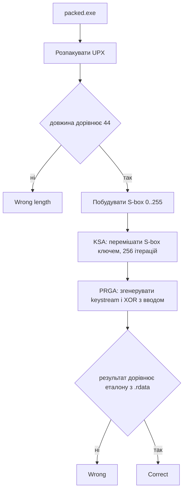

# 🧩 packed, розбір завдання


| Поле | Значення |
| --- | --- |
| Файл | `packed.exe`, PE32+ x86-64, близько 21 КБ (упакований), консольний |
| Запуск | `packed.exe <flag>` |
| Довжина прапора | рівно 44 символи |
| Категорія | Reverse Engineering |
| Ідея | упаковка UPX приховує код, усередині класичний RC4 |
| Прапор | `kpi2026{rc4_str34m_c1ph3r_und3r_a_upx_sh3ll}` |

## 📖 Що робить packed

packed це консольна програма, яка перевіряє прапор, але перед тим треба зняти шар упаковки UPX, під яким ховається весь справжній код. Після розпакування файл поводиться так. Якщо аргумента немає, друкується підказка usage. Якщо довжина рядка не дорівнює 44, друкується Wrong length. Будується таблиця перестановка (S-box) із 256 байтів. Ця таблиця переставляється відповідно до 16-байтного ключа (KSA). Для кожного байта прапора генерується один байт потоку і XOR'иться з ним (PRGA). Результат порівнюється з еталоном, зашитим у файл. Якщо всі 44 байти збіглися, друкується Correct, інакше Wrong.

## 🧰 Інструменти

| Інструмент | Для чого |
| --- | --- |
| `file` і `objdump -h` | Тип файлу, кількість і назви секцій |
| ентропія файлу (простий Python скрипт) | Підтвердити, що дані стиснуті або зашифровані |
| `upx -d` | Зняти упаковку і повернути звичайний PE |
| `strings`, `objdump -d` | Текстові повідомлення та код після розпакування |
| Python 3 | Відтворення RC4 і отримання прапора |

## 📚 Словничок для новачків

| Термін | Простими словами |
| --- | --- |
| UPX | Ultimate Packer for eXecutables, програма, яка стискає exe файл і додає маленький розпаковувач на початку |
| Секція (section) | Частина файлу з певною роллю, код, дані, таблиці тощо. Звичайний PE має 8 10 секцій |
| Ентропія | Міра хаотичності байтів. У звичайного коду вона середня, у стиснутих чи зашифрованих даних близька до максимуму |
| S-box | Таблиця перестановка з 256 значень, серце алгоритму RC4 |
| KSA | Key Scheduling Algorithm, етап, який перемішує S-box за допомогою ключа |
| PRGA | Pseudo Random Generation Algorithm, етап, який генерує сам потік байтів для шифрування |
| Keystream | Послідовність псевдовипадкових байтів, яку XOR'ять з даними |
| Симетричний шифр | Шифр, де той самий алгоритм і ключ і шифрують, і розшифровують дані |

## 🔍 Як розбирався packed

Крок 1. Визначення типу файлу.

```bash
file packed.exe
objdump -h packed.exe
```

Файл показує лише 3 секції замість звичайних 8 10.
| Термін | Простими словами |
| --- | --- |
| UPX | Ultimate Packer for eXecutables, програма, яка стискає exe файл і додає маленький розпаковувач на початку |
| Секція (section) | Частина
UPX0 0xd000 CONTENTS, ALLOC, CODE порожня у файлі
UPX1 0x5000 CONTENTS, ALLOC, LOAD стиснутий код і дані
UPX2 0x200 CONTENTS, ALLOC, LOAD таблиця імпорту


Назви UPX0, UPX1, UPX2 це пряма сигнатура пакувальника UPX.

Крок 2. Підтвердження через ентропію.

```python
import math
from collections import Counter

d = open("packed.exe", "rb").read()
c = Counter(d)
ent = -sum((v/len(d)) * math.log2(v/len(d)) for v in c.values())
print(len(d), ent)
```

Результат близько 7.77 біт на байт (максимум для байта це 8). Для звичайного коду типове значення 5 6.5. Висока ентропія ще один натяк на упаковку чи шифрування.

Крок 3. Розпакування.

```bash
upx -d packed.exe -o unpacked.exe
```

Файл зростає з 21 КБ до 40 КБ і перетворюється на звичайний 10 секційний PE. Далі працюємо з ним як зі звичайним бінарником.

Крок 4. Пошук функції перевірки.

```bash
objdump -d -M intel unpacked.exe > dump.txt
strings -n 6 unpacked.exe
```

У рядках одразу видно ключ відкритим текстом.

Super_Secret_K9y


Перевірка довжини.

```asm
cmp rax, 0x2c      ; 0x2c це 44
jne <Wrong length>
```

Крок 5. S-box і KSA. Перший блок коду заповнює масив числами 0..255 через SSE інструкції (paddd, punpcklwd, packuswb), це просто швидкий векторизований спосіб зробити `for i in range(256): S[i] = i`. Далі йде цикл рівно на 256 ітерацій.

```asm
; j = (j + S[i] + key[i % 16]) & 0xff
movzx eax, BYTE PTR [key+rcx]
add   edx, eax
add   edx, [S+rbx]
and   edx, 0xff
; swap(S[i], S[j])
mov   al, [S+rbx]
mov   bl, [S+rdx]
mov   [S+rbx], bl
mov   [S+rdx], al
```

Це класичний KSA з алгоритму RC4, ключ перемішує S-box.

Крок 6. PRGA і шифрування вводу. Другий цикл, по одній ітерації на кожен байт прапора.

```asm
; i++; j += S[i]; swap(S[i], S[j])
inc   esi
movzx eax, BYTE PTR [S+rsi]
add   edx, eax
and   edx, 0xff
; K = S[(S[i]+S[j]) & 0xff]
movzx eax, BYTE PTR [S+rsi]
add   eax, [S+rdx]
and   eax, 0xff
movzx eax, BYTE PTR [S+rax]
; xor з байтом введеного флага
xor   al, [flag+r8]
```

Це PRGA. Разом KSA плюс PRGA це стопроцентний RC4.

Крок 7. Витяг еталону. Зашифрований результат (44 байти) порівнюється з таблицею у .rdata через memcmp.

## ⚙️ Схема перевірки



## 🔓 Як знайдено прапор

RC4 це потоковий шифр, і він симетричний, та сама операція XOR з keystream, що перетворює прапор на шифротекст, перетворює шифротекст назад на прапор. Нічого обертати не потрібно, досить згенерувати той самий keystream (знаючи ключ Super_Secret_K9y і алгоритм RC4) і зробити XOR з еталоном із файлу.

```python
def rc4_keystream(key, n):
    S = list(range(256)); j = 0
    for i in range(256):
        j = (j + S[i] + key[i % len(key)]) & 0xff
        S[i], S[j] = S[j], S[i]
    i = j = 0
    out = bytearray()
    for _ in range(n):
        i = (i + 1) & 0xff
        j = (j + S[i]) & 0xff
        S[i], S[j] = S[j], S[i]
        out.append(S[(S[i] + S[j]) & 0xff])
    return bytes(out)

target = bytes.fromhex("9dfdf517b11122fb66d5d273ec6b09cdae3c601cc0ca983f0cc7367510947428633ddded51d6ba16b0fc9784")
key = b"Super_Secret_K9y"

ks = rc4_keystream(key, len(target))
print(bytes(a ^ b for a, b in zip(target, ks)).decode())
```

```bash
python solve.py
```

## 🏁 Прапор

```text
kpi2026{rc4_str34m_c1ph3r_und3r_a_upx_sh3ll}
```

Прапор натякає на головне. Потоковий шифр RC4 ховається під шаром упаковки UPX.

## 📚 Висновки

UPX і подібні пакувальники видно одразу, мало секцій, дивні імена (UPX0, UPX1, UPX2), висока ентропія. Перше, що варто перевірити перед будь яким глибоким аналізом. Розпакувати відомим пакувальником завжди простіше, ніж аналізувати стиснутий код вручну, upx -d вирішує задачу за секунду. RC4 легко впізнати за формою, цикл на 256 ітерацій зі swap (KSA), другий цикл такої ж форми (PRGA), і фінальний XOR результату з даними. Ключ часто лежить відкритим текстом у рядках файлу, перший крок після розпакування завжди strings. RC4 симетричний, розшифрування і шифрування це одна й та сама дія, тому обертати формулу не потрібно.
