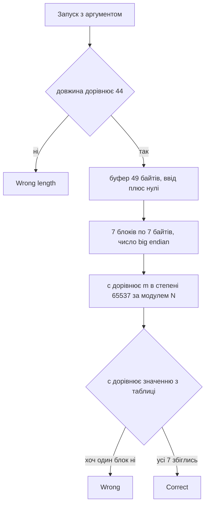

# 🔐 rsa, розбір завдання


| Поле | Значення |
| --- | --- |
| Файл | `rsa.exe`, PE32+ x86-64, близько 41 КБ, консольний |
| Запуск | `rsa.exe <flag>` |
| Довжина прапора | рівно 44 байти |
| Алгоритм | RSA без доповнення, `e = 65537`, 62 бітний модуль |
| Категорія | Reverse Engineering і криптографія |
| Прапор | `kpi2026{sm4ll_rsa_m0duli_g3t_f4ct0r3d_qu1ck}` |

---

## 📖 Що робить rsa

rsa це консольна програма, яка перевіряє прапор. Прапор передається першим аргументом командного рядка. Далі відбувається таке.

1. Якщо аргумента немає, друкується підказка usage.
2. Якщо довжина рядка не дорівнює 44, друкується Wrong length.
3. Введені байти копіюються в буфер і добиваються нулями до 49. Виходить 7 шматків по 7 байтів.
4. Кожен шматок читається як одне велике число m у порядку big endian.
5. Число шифрується за RSA, тобто рахується c = m в степені e за модулем N.
6. Отримані 7 значень порівнюються із 7 зашитими у файл 64 бітними числами.
7. Якщо збіглись усі сім, друкується Correct, інакше Wrong.

Програма нічого не розшифровує. Вона шифрує введене й дивиться, чи вийшов потрібний шифртекст. Тому якщо розшифрувати зашиті числа, вийде сам прапор.

---

## 🧰 Інструменти

| Інструмент | Для чого |
| --- | --- |
| `file` і `strings` | Тип файлу та текстові повідомлення |
| `objdump -h`, `-s`, `-d` | Секції, дамп таблиці, дизасемблювання |
| Ghidra | Зручне читання функції перевірки |
| Python 3 і `sympy` | Розклад числа на множники й арифметика за модулем |

---

## 📚 Словник

| Термін | Простими словами |
| --- | --- |
| RSA | Шифр з відкритим ключем. Шифрувати може кожен, а розшифрувати лише той, хто знає секрет |
| Модуль N | Велике число, яке дорівнює добутку двох простих чисел p і q. Воно є частиною відкритого ключа |
| Відкрита експонента e | Число, у яке підносять повідомлення при шифруванні. Найчастіше це 65537 |
| Закрита експонента d | Секрет для розшифрування. Його можна порахувати, лише знаючи p і q |
| Просте число | Число, яке ділиться тільки на одиницю і на себе |
| Факторизація | Розклад числа на прості множники. Для великих чисел це практично неможливо, і на цьому тримається безпека RSA |
| Функція Ейлера φ(N) | Для N = p · q дорівнює (p мінус 1) помножити на (q мінус 1) |
| Обернене за модулем | Число d таке, що e помножити на d дає одиницю за модулем φ(N). Знаходиться функцією `pow(e, -1, phi)` |
| Big endian | Порядок байтів, у якому старший байт іде першим, так само як числа читаються на папері |
| Доповнення, padding | Додавання випадкових або службових байтів перед шифруванням. Тут його немає, лише нульове добивання |

---

## 🔍 Як розбирався rsa

### Крок 1. Визначення типу файлу

```bash
file rsa.exe
strings -n 4 rsa.exe
```

Файл виявився нативною програмою для Windows x64. У рядках видно usage: %s <flag>, Wrong length., Correct! та Wrong. Прапор передається аргументом.

### Крок 2. Пошук функції перевірки

```bash
objdump -d -M intel rsa.exe > dump.txt
```

Функція перевірки знаходиться перед виводом текстів. Вона починається з порівняння довжини.

```asm
cmp rax, 0x2c      ; 0x2c це 44
jne <Wrong length>
```

### Крок 3. Підготовка буфера

Спершу буфер заповнюється нулями командою `rep stos`, потім у нього копіюються 44 байти введеного рядка (одинадцять слів по 4 байти, команда `rep movs`). Завдяки цьому кінець буфера, починаючи з 45 байта, лишається нулями. Цикл далі обробляє 49 байтів, тобто 7 блоків по 7 байтів, а лічильник зростає на 7 до значення 0x31, тобто 49.

### Крок 4. Читання блока як числа

Внутрішній цикл бере 7 байтів і збирає з них число.

```asm
movzx edx, BYTE PTR [rax]    ; наступний байт
shl   rcx, 8                 ; зсунути накопичене число на байт
or    rcx, rdx               ; додати байт
cmp   rax, r15               ; повторити 7 разів
```

Старші байти йдуть першими, тож це big endian. Число з семи байтів не перевищує 2 в степені 56, тобто завжди менше за модуль N, тому зайвого зациклення не відбувається.

### Крок 5. Піднесення до степеня

Далі йде класичне піднесення до степеня за методом квадратів і множення. У коді добре видно сталі.

```asm
mov ebx, 0x10001                 ; e = 65537
movabs rax, 0x2250f38be239677f   ; N
mov ebp, 0x11                    ; 17 ітерацій, стільки бітів у e
```

Показник 65537 має 17 бітів, звідси лічильник 0x11. На кожній ітерації результат і основа множаться, а потім береться залишок від ділення на N. Добуток двох 64 бітних чисел не вміщується в регістр, тому залишок рахується допоміжною функцією для 128 бітних значень.

### Крок 6. Порівняння з таблицею

Після піднесення результат порівнюється з 64 бітним значенням з таблиці.

```asm
cmp QWORD PTR [r8], r14      ; r8 вказує на таблицю, r14 це обчислене c
cmovne r9d, eax              ; не збіглось, прапорець успіху скидається
add r8, 8                    ; наступний елемент таблиці
```

Таблиця лежить за адресою `0x14000a040` у секції `.rdata`, 7 значень по 8 байтів, зберігаються як little endian.

```text
0x0a708c9aca789474
0x1c53815cdc877c1d
0x1da080e9db8b0d69
0x20f0b1e3b5f893b0
0x1faab91031c183b9
0x0469226db55425c8
0x0d64793d1acb7806
```

---

## ⚙️ Схема перевірки



---

## 🔓 У чому вразливість

Безпека RSA тримається на тому, що розкласти N на два прості числа дуже важко. Для цього N має бути величезним, сучасні ключі мають від 2048 бітів. Тут же N дорівнює `0x2250f38be239677f`, тобто близько 2.47 помножити на 10 в вісімнадцятому степені. Це всього 62 біти.

Таке число розкладається за долі секунди навіть звичайним `sympy`.

```text
N = 1397687969 × 1769167391
```

Ще дві слабкості посилюють проблему.

1. Немає доповнення. Шифрування детерміноване, тому достатньо розшифрувати кожен блок окремо.
2. Блоки малі. Кожне m менше за N, тож розшифрування повертає рівно те, що було введено, без жодних залишків.

---

## 🔓 Як знайдено прапор

Кроки такі.

1. Прочитати з файлу N, e та таблицю з 7 значень.
2. Розкласти N на p і q.
3. Порахувати φ(N) = (p мінус 1) помножити на (q мінус 1).
4. Знайти закритий показник d як обернене до e за модулем φ(N).
5. Для кожного c порахувати m = c в степені d за модулем N.
6. Перетворити кожне m у 7 байтів big endian й склеїти.
7. Відкинути нульове добивання наприкінці.

```python
import struct
import sys
from sympy import factorint

d_file = open(sys.argv[1], "rb").read()

def rdata(va, n):
    # секція .rdata, віртуальна адреса 0x14000a000, зсув у файлі 0x7800
    off = va - 0x14000A000 + 0x7800
    return d_file[off:off + n]

N = 0x2250F38BE239677F
e = 0x10001
table = struct.unpack("<7Q", rdata(0x14000A040, 56))

# розклад модуля на прості множники
(p, _), (q, _) = sorted(factorint(N).items())
phi = (p - 1) * (q - 1)

# закрита експонента
d = pow(e, -1, phi)

# розшифрування кожного блока
plain = b"".join(pow(c, d, N).to_bytes(7, "big") for c in table)

flag = plain[:44]
print(flag.decode())

# перевірка прямим шифруванням
padded = flag + b"\x00" * 5
blocks = [int.from_bytes(padded[i * 7:i * 7 + 7], "big") for i in range(7)]
assert all(pow(m, e, N) == c for m, c in zip(blocks, table))
```

```bash
pip install sympy
python solve.py rsa.exe
```

Результат по блоках.

| Блок | Розшифроване число m | Байти |
| --- | --- | --- |
| 0 | `0x6b706932303236` | `kpi2026` |
| 1 | `0x7b736d346c6c5f` | `{sm4ll_` |
| 2 | `0x7273615f6d3064` | `rsa_m0d` |
| 3 | `0x756c695f673374` | `uli_g3t` |
| 4 | `0x5f663463743072` | `_f4ct0r` |
| 5 | `0x33645f71753163` | `3d_qu1c` |
| 6 | `0x6b7d0000000000` | `k}` і п'ять нулів |

Останній блок підтверджує опис. 44 не ділиться на 7, тому в ньому лише два справжні байти, а решта п'ять це нульове добивання. Зворотне шифрування знайденого прапора дає рівно ті самі сім чисел, що лежать у файлі.

---

## 🏁 Прапор

```text
kpi2026{sm4ll_rsa_m0duli_g3t_f4ct0r3d_qu1ck}
```

Прапор натякає на головне. Малі модулі RSA швидко розкладаються на множники.

---

## 📚 Висновки

- Константа 0x10001 у коді майже завжди означає відкриту експоненту RSA, а поруч зазвичай стоїть модуль.
- Безпека RSA залежить від розміру модуля. 62 біти це не захист, а лише ілюстрація.
- Якщо програма шифрує ввід і порівнює з таблицею, а ключ відкритий, достатньо розшифрувати таблицю.
- Для розшифрування потрібні лише p і q, а їх дає факторизація, яка для малого N займає долі секунди.
- Порядок байтів важливий. Блоки тут big endian, а таблиця у файлі зберігається як little endian.
- RSA без доповнення детермінований, тому кожен блок можна атакувати окремо.
