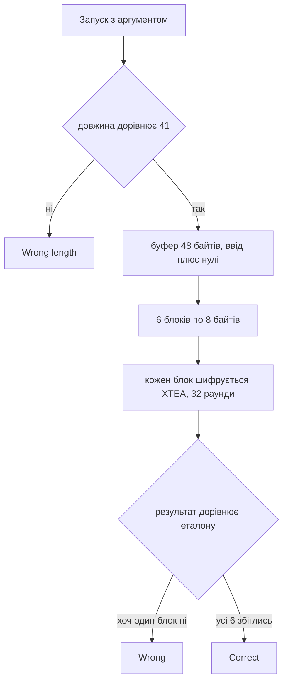

# 🏦 vault, розбір завдання


| Поле | Значення |
| --- | --- |
| Файл | `vault.exe`, PE32+ x86-64, MinGW, близько 40 КБ, не запакований |
| Запуск | `vault.exe <flag>` |
| Довжина прапора | рівно 41 символ |
| Категорія | Reverse Engineering |
| Алгоритм | XTEA, 32 раунди, ключ 16 байт |
| Прапор | `kpi2026{x73a_f31st3l_n3tw0rks_st1ll_fall}` |

---

## 📖 Що робить vault

vault це консольна програма, яка перевіряє прапор. Прапор передається першим аргументом командного рядка. Далі відбувається таке.

1. Якщо аргумента немає, друкується підказка usage.
2. Якщо довжина рядка не дорівнює 41, друкується Wrong length.
3. Введений рядок копіюється в буфер і добивається нулями до 48 байт. Виходить 6 блоків по 8 байт. В останньому блоці лежить один символ і сім нулів.
4. Кожен блок шифрується алгоритмом XTEA з ключем із 16 байт, зашитим у файл.
5. Результат кожного блока порівнюється з еталоном, який теж лежить у файлі.
6. Якщо збіглись усі шість блоків, друкується Correct, інакше Wrong.

Тобто програма не розшифровує нічого з прапора, а навпаки шифрує введене й дивиться, чи вийшов потрібний шифртекст.

---

## 🧰 Інструменти

| Інструмент | Для чого |
| --- | --- |
| `file` і `strings` | Тип файлу та текстові повідомлення |
| `objdump -h`, `-s`, `-d` | Секції, дамп даних, дизасемблювання |
| Ghidra | Зручне читання функції main |
| Python 3 | Реалізація XTEA, шифрування та розшифрування |

---

## 📚 Словничок для новачків

| Термін | Простими словами |
| --- | --- |
| Блочний шифр | Алгоритм, що шифрує дані шматками фіксованого розміру. Для XTEA розмір блока 8 байтів |
| XTEA | Простий і дуже короткий блочний шифр. Працює з двома 32 бітними числами, за 32 раунди перемішує їх за допомогою ключа |
| Ключ | Секретне значення шифру. Тут це 4 числа по 32 біти, тобто 16 байтів |
| Раунд | Один крок перемішування. Їх повторюють багато разів, щоб результат став непередбачуваним |
| Delta | Константа XTEA, дорівнює `0x9E3779B9`. На ній тримається зміна параметра sum на кожному раунді |
| Little endian | Порядок байтів, у якому молодший байт числа йде першим. Так зберігаються числа на звичайних процесорах x86 |
| Еталон | Заздалегідь пораховане правильне значення, з яким порівнюється результат |
| Оборотне перетворення | Таке, яке можна виконати у зворотний бік, якщо відомий ключ. Блочні шифри саме такі |

---

## 🔍 Як розбирався vault

### Крок 1. Визначення типу файлу

```bash
file vault.exe
strings -n 4 vault.exe
```

Файл виявився звичайною нативною програмою для Windows x64. У рядках видно usage: %s <flag>, Wrong length., Correct! та Wrong. Це відразу показує, що прапор передається аргументом.

### Крок 2. Пошук функції перевірки

```bash
objdump -d -M intel vault.exe > dump.txt
```

Усередині дампа функцію перевірки видно за посиланнями на тексти з секції `.rdata`. Вона починається з порівняння довжини.

```asm
cmp rax, 0x29      ; 0x29 це 41
```

Якщо довжина інша, виводиться Wrong length. Далі йде підготовка буфера.

### Крок 3. Підготовка буфера

Спершу буфер заповнюється нулями командою `rep stos`, потім у нього копіюється введений рядок командою `rep movs`. Через це все, що довше за 41 байт, залишається нулями. Усього в обробці 48 байтів, тобто рівно 6 блоків по 8 байтів. Цикл крутиться, поки вказівник на поточний блок не дійде до кінця буфера.

### Крок 4. Упізнавання алгоритму

Сам цикл шифрування короткий і виглядає дуже характерно. Для впізнавання вистачило кількох ознак.

| Що видно в коді | Що це означає |
| --- | --- |
| `sub edx, 0x61c88647` | Те саме, що додати 0x9E3779B9, тобто delta з XTEA |
| `cmp edx, 0xc6ef3720` | Умова виходу з циклу. Це 32 помножити на delta, тобто рівно 32 раунди |
| зсуви `shl 4` та `shr 5` | Формула змішування з XTEA |
| `and eax, 3` та `shr eax, 0xb` потім `and 3` | Вибір слова ключа за sum, перший раз за двома молодшими бітами, другий раз за бітами 11 і 12 |

Усе разом однозначно вказує на стандартний XTEA без змін. Тож жодних таблиць і нестандартних констант відновлювати не потрібно.

### Крок 5. Пошук ключа та еталона

Адреса, звідки програма читає ключ, видна в дизасемблері на початку функції.

```asm
movdqu xmm0, XMMWORD PTR [rip+0x1521]    ; адреса 0x140009070
```

Еталон береться з адреси `0x140009040`. Обидва шматки лежать у секції `.rdata`.

```text
ключ, 16 байтів на 0x140009070
0df0ad1b efbeadde bebafeca 0df0ad8b

еталон, 48 байтів на 0x140009040
1173de58f4c7ee689ef14ab4ba8515322576b9e8243252fa51f5f8cd05cad817
c0e434944873d17a7c5c243c70f0799f
```

Ключ читається як чотири числа little endian.

| Слово | Значення |
| --- | --- |
| key[0] | `0x1badf00d` |
| key[1] | `0xdeadbeef` |
| key[2] | `0xcafebabe` |
| key[3] | `0x8badf00d` |

Усі чотири це відомі жартівливі hex слова, тож ключ без сумнівів справжній.

### Крок 6. Логіка порівняння

Після 32 раундів перші 4 байти результату порівнюються з першими 4 байтами еталона, далі інші 4 байти. Якщо хоч раз збіг не стався, прапорець успіху скидається в нуль. Наприкінці за цим прапорцем програма вибирає, який текст друкувати, Correct чи Wrong. Це зроблено без стрибків, однією інструкцією `cmovne`.

---

## ⚙️ Схема перевірки



---

## 🔓 Як знайдено прапор

Ключ і еталон лежать прямо у файлі, а XTEA оборотний. Тому достатньо розшифрувати еталон тим самим ключем. Те, що вийде, і є введений рядок, який дає саме такий шифртекст.

Розшифрування це ті самі раунди в зворотному порядку.

1. Параметр sum стартує з 32 помножити на delta.
2. Спершу від v1 віднімається значення, яке залежить від v0 та ключа.
3. Потім sum зменшується на delta.
4. Після цього від v0 віднімається значення, яке залежить від v1 та ключа.
5. Крок повторюється 32 рази.

Блоки читаються як два числа little endian.

```python
import struct
import sys

d = open(sys.argv[1], "rb").read()

def rdata(va, n):
    # секція .rdata, віртуальна адреса 0x140009000, зсув у файлі 0x7400
    off = va - 0x140009000 + 0x7400
    return d[off:off + n]

ref = rdata(0x140009040, 48)
key = struct.unpack("<4I", rdata(0x140009070, 16))

M = 0xFFFFFFFF
DELTA = 0x9E3779B9

def enc(v0, v1):
    s = 0
    for _ in range(32):
        v0 = (v0 + ((((v1 << 4) & M) ^ (v1 >> 5)) + v1 ^ (s + key[s & 3]))) & M
        s = (s + DELTA) & M
        v1 = (v1 + ((((v0 << 4) & M) ^ (v0 >> 5)) + v0 ^ (s + key[(s >> 11) & 3]))) & M
    return v0, v1

def dec(v0, v1):
    s = (DELTA * 32) & M
    for _ in range(32):
        v1 = (v1 - ((((v0 << 4) & M) ^ (v0 >> 5)) + v0 ^ (s + key[(s >> 11) & 3]))) & M
        s = (s - DELTA) & M
        v0 = (v0 - ((((v1 << 4) & M) ^ (v1 >> 5)) + v1 ^ (s + key[s & 3]))) & M
    return v0, v1

plain = b""
for i in range(6):
    a, b = struct.unpack("<2I", ref[i * 8:i * 8 + 8])
    plain += struct.pack("<2I", *dec(a, b))

flag = plain[:41]
print(flag.decode())

# перевірка прямим шифруванням
padded = flag + b"\x00" * 7
check = b"".join(
    struct.pack("<2I", *enc(*struct.unpack("<2I", padded[i * 8:i * 8 + 8])))
    for i in range(6)
)
assert check == ref
```

```bash
python solve.py vault.exe
```

Результат розшифрування по блоках.

| Блок | Еталон | Відкритий текст |
| --- | --- | --- |
| 0 | `1173de58f4c7ee68` | `kpi2026{` |
| 1 | `9ef14ab4ba851532` | `x73a_f31` |
| 2 | `2576b9e8243252fa` | `st3l_n3t` |
| 3 | `51f5f8cd05cad817` | `w0rks_st` |
| 4 | `c0e434944873d17a` | `1ll_fall` |
| 5 | `7c5c243c70f0799f` | `}` і сім нулів |

Останній блок підтверджує опис. Там справді лише один символ, закриваюча дужка, а решта це нульове добивання. Зворотне шифрування знайденого прапора дає рівно ті самі 48 байтів, що лежать у файлі.

---

## 🏁 Прапор

```text
kpi2026{x73a_f31st3l_n3tw0rks_st1ll_fall}
```

Прапор натякає на головне. Мережі Фейстеля, до яких належить XTEA, залишаються вразливими, якщо ключ лежить поруч із шифртекстом.

---

## 📚 Висновки

- Характерні константи швидко видають алгоритм. Тут це 0x61c88647 (мінус delta) і 0xc6ef3720 (32 помножити на delta).
- Якщо програма шифрує ввід і порівнює з еталоном, а ключ зберігається в тому самому файлі, достатньо розшифрувати еталон.
- Блочні шифри оборотні за наявності ключа, тож підбирати нічого не потрібно.
- Не варто забувати про добивання нулями. Саме воно пояснює, чому довжина 41, а оброблюється 48 байтів.
- Порядок байтів важливий. І ключ, і блоки читаються як числа little endian.
