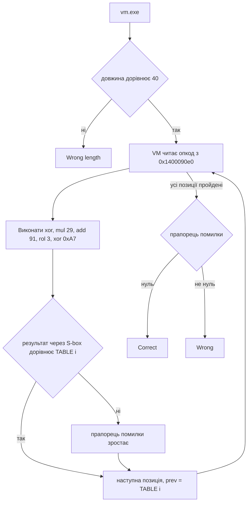

# 🧩 vm, розбір завдання


| Поле | Значення |
| --- | --- |
| Файл | `vm.exe`, PE32+ x86-64, близько 40 КБ, консольний |
| Запуск | `vm.exe <flag>` |
| Довжина прапора | рівно 40 символів |
| Категорія | Reverse Engineering |
| Ідея | власна байткод VM з ланцюговим генератором таблиці |
| Прапор | `kpi2026{cu5t0m_v1rtu4l_m4ch1n3s_4r3_fun}` |

## 📖 Що робить vm

vm це нативний бінарник для Windows x64, зібраний MinGW, не запакований. Перевірка побудована не на прямому коді, а на власному маленькому байткод інтерпретаторі. Опкоди в ньому генеричні, load, store, xor, add, mul, rol, sar, shl, and, а сама логіка перевірки закодована окремо, як послідовність опкодів з операндами в .rdata за адресою `0x1400090e0`.

## 🧰 Інструменти

| Інструмент | Для чого |
| --- | --- |
| `file`, `objdump -h` | Тип файлу, секції |
| `objdump -d` | Пошук входу main і диспетчера VM |
| Ghidra | Читання опкодів і побудова псевдокоду вручну |
| Python 3 | Відтворення ланцюжка операцій і отримання прапора |

## 📚 Словник

| Термін | Простими словами |
| --- | --- |
| Байткод VM | Власна мінімальна мова з генеричними опкодами і свій інтерпретатор до неї, усередині одного бінарника |
| Диспетчер (dispatch loop) | Головний цикл VM, який читає черговий опкод і передає керування потрібному обробнику |
| prev | Значення з попереднього кроку ланцюжка, яке впливає на наступний крок |
| ROL, ROR | Циклічний зсув бітів, вліво або вправо, старші біти, що виходять за межу, зʼявляються з іншого боку |
| Обернений елемент за модулем | Число, на яке якщо помножити результат множення, повертає вихідне значення, за модулем 256 |
| S-box | Таблиця підстановки, тут вона також виконує роль таблиці еталонних значень для порівняння |

## 🔍 Як розбирався vm

Крок 1. Визначення типу файлу.

```bash
file vm.exe
objdump -h vm.exe
```

Звичайний 10 секційний PE, не запакований, зібраний MinGW.

Крок 2. Пошук main.

```bash
objdump -d -M intel vm.exe > dump.txt
strings -n 5 vm.exe
```

Перевірка довжини.

```asm
cmp rax, 0x28      ; 0x28 це 40
jne <Wrong length>
```

Крок 3. Диспетчер VM. Одразу після перевірки довжини видно характерну структуру байткод інтерпретатора.

```asm
lea r8, [rip+...]       ; r8 вказує на байткод, адреса 0x1400090e0
lea r9, [rip+...]       ; r9 вказує на таблицю переходів, адреса 0x140009034
mov ecx, edx
cmp BYTE PTR [r8+rcx], 0x16   ; номер опкоду не більше 22
ja  <Wrong>
movzx ecx, BYTE PTR [r8+rcx]
movsxd rcx, DWORD PTR [r9+rcx*4]
add rcx, r9
jmp rcx                        ; перехід на обробник опкода
```

Це той самий принцип, що й у диспетчера звичайного switch, тільки написаний вручну для власної віртуальної машини.

Крок 4. Опкоди ланцюжка. Серед близько 20 обробників знайдено потрібні, load символу за індексом, xor з prev, множення по модулю 256, додавання, циклічний зсув (rol), ще один xor, і окремий опкод порівняння через таблицю підстановки.

```asm
mul   BYTE PTR [rsp+r11*1+0x20]      ; множення
xor   BYTE PTR [rsp+r11*1+0x20], al  ; xor
add   BYTE PTR [rsp+r11*1+0x20], al  ; додавання
rol   BYTE PTR [rsp+r11*1+0x20], cl  ; циклічний зсув вліво
```

Опкод порівняння бере поточне значення, шукає його в таблиці за адресою `0x1400090a0` (підстановка), і звіряє з очікуваним байтом.

```asm
lea   rcx, [rip+...]       ; rcx це 0x1400090a0, таблиця
movzx eax, BYTE PTR [rcx+rax*1]
cmp   BYTE PTR [rsp+r11*1+0x20], al
cmovne r10d, eax            ; не збіглось, прапорець помилки зростає
```

Крок 5. Відтворення алгоритму в псевдокоді. Переклавши опкоди у звичайний псевдокод, виходить такий ланцюжок на кожну позицію i.
reg0 = 0
reg2 = 66
reg3 = 40

цикл:
reg1 = flag[reg0]
reg1 = reg1 XOR reg2
reg1 = reg1 * 29 (mod 256)
reg1 = reg1 + 91 (mod 256)
reg1 = rol8(reg1, 3)
reg1 = reg1 XOR 0xA7
порівняти reg1 з TABLE[reg0]
reg2 = reg1
reg0 += 1
якщо (40 - reg0) != 0: повторити цикл

Крок 6. Витяг таблиці. Таблиця лежить за адресою `0x1400090a0`, 40 байтів.

```text
167 18 245 144 124 46 63 223 154 212 97 66 141 122 195 65
255 5 230 183 54 203 95 143 243 250 136 37 113 9 206 225
68 108 87 189 246 54 61 123
```

## ⚙️ Ключовий момент

Здається, що перевірка символу i залежить від prev, результату попереднього кроку, тобто утворює ланцюжок. Але на наступній ітерації prev одразу переприсвоюється не обчисленим значенням reg1, а значенням TABLE[i], яке вже відоме наперед з самого бінарника. Через це ланцюжок насправді не накопичує залежність від угаданого символу, кожен крок обертається незалежно, і як prev завжди береться TABLE[i-1].

## ⚙️ Схема перевірки



## 🔓 Як знайдено прапор

Оскільки prev на кожному кроці береться з уже відомої таблиці, а не з угаданого символу, рівняння для кожної позиції можна обернути незалежно, у зворотному порядку операцій відносно прямого ланцюжка, xor з 0xA7, циклічний зсув вправо на 3, віднімання 91, множення на обернений елемент 29 за модулем 256, і фінальний xor з prev.

```python
TABLE = [167, 18, 245, 144, 124, 46, 63, 223, 154, 212, 97, 66, 141, 122, 195, 65,
         255, 5, 230, 183, 54, 203, 95, 143, 243, 250, 136, 37, 113, 9, 206, 225,
         68, 108, 87, 189, 246, 54, 61, 123]

inv29 = pow(29, -1, 256)

def ror8(v, n):
    n &= 7
    return ((v >> n) | (v << (8 - n))) & 0xFF

flag = []
prev = 66
for t in TABLE:
    x = t ^ 0xA7
    x = ror8(x, 3)
    x = (x - 91) % 256
    x = (x * inv29) % 256
    flag.append(x ^ prev)
    prev = t

print(bytes(flag).decode())
```

```bash
python solve.py
```

## 🏁 Прапор

```text
kpi2026{cu5t0m_v1rtu4l_m4ch1n3s_4r3_fun}
```

Прапор натякає на головне. Власна байткод VM, попри грізний вигляд, це лише ще один шар обгортки навколо простого ланцюжка операцій.

## 📚 Висновки

Диспетчер з таблицею переходів і генеричними опкодами виглядає лякливо, але завжди зводиться до того самого прийому, що й звичайний switch, тільки написаний вручну. Ключовий момент у тому, щоб відстежити, звідки насправді береться prev на кожній ітерації, бо саме це визначає, чи задача дійсно ланцюгова, чи кожен крок насправді незалежний. Таблиця еталонних значень тут одночасно виконує роль S-box підстановки, тому варто уважно дивитись, чи порівняння йде напряму, чи через додаткову підстановку.
